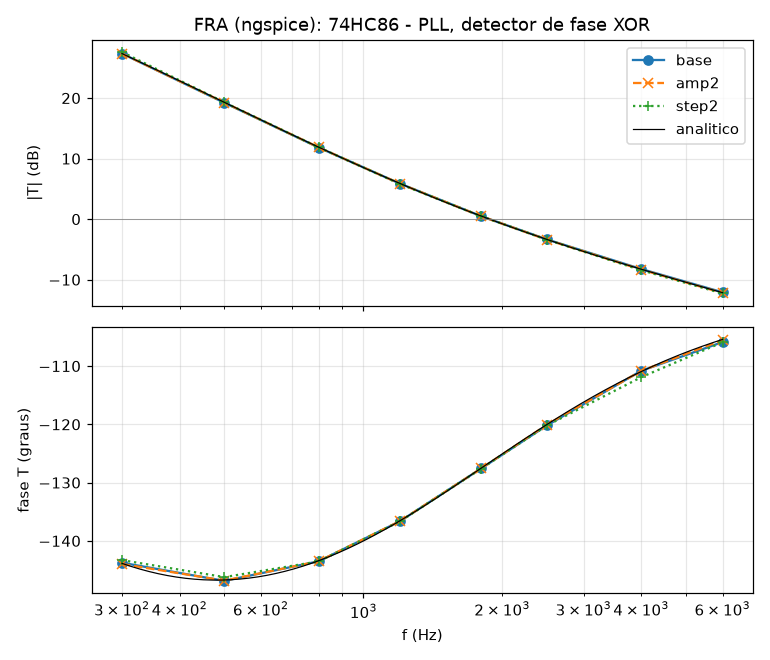

# 74HC86 — behavioural SPICE model for LTspice

A functional (`.subckt`) macromodel of the **74HC86 quad 2-input exclusive-OR
gate** (high-speed silicon-gate CMOS), built from the ON Semiconductor
datasheet *74HC86/D, March 2007 – Rev. 1*.

It is not a transistor-level model. Each of the four gates is reproduced by
its **terminal behaviour** — CMOS input threshold, XOR function, internal
propagation delay and a current-limited push-pull output — with every number
fitted to the DC and AC ELECTRICAL CHARACTERISTICS tables. The point is to
simulate logic *as an analogue circuit*: real edges, real delays that depend
on V<sub>CC</sub> and on your load, real supply current, while staying fast
and convergent next to power stages and PLL loops.

**This datasheet gives no typical values** (it defers them to the DL129/D data
book), so the model sits **at the guaranteed limit of the −55…25 °C column**.
It is a slow-corner part on purpose: if your circuit works with it, it works
with any 74HC86 that meets the datasheet. `KT` moves it to the 85 °C and
125 °C columns, or makes it faster.

## Files

| File | What it is |
|---|---|
| `74HC86.lib` | the model — a single `.subckt 74HC86`, heavily commented |
| `74HC86.asy` | LTspice symbol, 14-pin layout, pin order 1…14, pins on the 16-unit grid |
| `examples/` | netlists prontos: tabela verdade, inversor controlado, detector de fase, dobrador de frequência, gerador de paridade, oscilador em anel, PLL |
| `tests/` | datasheet regression tests (see *Verification*) |
| `docs/` | FRA (loop-gain) plot of the PLL example |

## Installing in LTspice

1. Copy `74HC86.lib` and `74HC86.asy` next to your schematic (or into
   `Documents\LTspiceXVII\lib\sub` and `...\lib\sym`).
2. Place the symbol with **F2 → (your directory) → 74HC86**.
3. The symbol already carries `SYMATTR ModelFile 74HC86.lib`, so LTspice pulls
   the model in by itself. In a plain netlist:

```
.include 74HC86.lib
X1 A1 B1 Y1 A2 B2 Y2 GND Y3 A3 B3 Y4 A4 B4 VCC 74HC86
```

### What to put on the schematic

```
.tran 0 <stop> 0 <maxstep>        e.g.  .tran 0 10u 0 1n
```

The model has no oscillator or latch of its own, so it does not *need* a step
limit to be correct. But the edges are 13–75 ns long (depending on
V<sub>CC</sub>); a `maxstep` of about **a tenth of the transition time**
(1 ns at 5 V) is what makes the waveforms, and any `.meas` of delay, look
right. In a switching-converter or PLL simulation where the gate is not the
point, the converter's own step limit is enough.

**Tie every unused input to GND or V<sub>CC</sub>**, as the datasheet demands
and as the examples do. A floating input reads LOW in the model (through a
1 GΩ leakage) — in the real part it is undefined.

## Pinout

The port order is the package pin order, pin 1 through pin 14:

| # | Name | | # | Name |
|---:|---|---|---:|---|
| 1 | `A1` | | 8 | `Y3` |
| 2 | `B1` | | 9 | `A3` |
| 3 | `Y1` | | 10 | `B3` |
| 4 | `A2` | | 11 | `Y4` |
| 5 | `B2` | | 12 | `A4` |
| 6 | `Y2` | | 13 | `B4` |
| 7 | `GND` | | 14 | `VCC` |

Y = A ⊕ B = A̅B + AB̅ (function table: LL → L, LH → H, HL → H, HH → L).

Everything inside the model is referenced to `GND` (pin 7), not to node 0,
so the part works with a lifted ground.

## How each block is modelled

| Block | Model | From the datasheet |
|---|---|---|
| Supply | 2.0–6.0 V; every V<sub>CC</sub>-dependent quantity is interpolated piecewise-linearly between the table's 2 / 3 / 4.5 / 6 V columns and held outside them | *Recommended Operating Conditions* |
| Input | threshold at V<sub>CC</sub>/2, narrow transition (±0.04 V<sub>CC</sub>), no hysteresis; 10 pF; ESD diodes to both rails; 1 GΩ leakage | V<sub>IH</sub> = 0.7 V<sub>CC</sub>-ish, V<sub>IL</sub> = 0.3 V<sub>CC</sub>-ish, C<sub>in</sub> ≤ 10 pF, I<sub>in</sub> ≤ 0.1 µA |
| Logic | XOR of the two digitised inputs, formed **before** the delay | function table |
| Delay | first-order internal lag τ(V<sub>CC</sub>) + comparator — an *inertial* delay: pulses much shorter than t<sub>pd</sub> are swallowed | t<sub>PLH</sub>, t<sub>PHL</sub> |
| Output | pull-up and pull-down, each I = I<sub>sat</sub>·tanh(V/V<sub>0</sub>): a resistor for small drops that saturates at I<sub>sat</sub>; 5 pF pin capacitance; ESD diodes | V<sub>OL</sub>, V<sub>OH</sub>, t<sub>TLH</sub>, t<sub>THL</sub> |
| Supply current | I<sub>CCQ</sub> + C<sub>PD</sub> dynamic current; load current flows through the VCC and GND pins | I<sub>CC</sub> ≤ 2 µA, C<sub>PD</sub> = 33 pF |

### How the output stage was fitted

The datasheet gives, at each V<sub>CC</sub>, a DC point (V<sub>OL</sub> ≤ 0.26 V
and V<sub>OH</sub> ≥ V<sub>CC</sub> − 0.52 V at 2.4 / 4.0 / 5.2 mA) and a
transient point (10–90 % transition time into 50 pF). A plain resistor cannot
meet both: the resistance that gives 0.26 V at 4 mA (65 Ω) is twice as fast
as 15 ns into 50 pF. A real CMOS output is a resistor at small V<sub>DS</sub>
and a current source at large V<sub>DS</sub>, and the `tanh` driver is exactly
that. Fitting, per V<sub>CC</sub> column:

* **pull-down**: V<sub>0</sub> so V<sub>OL</sub> = 0.26 V exactly at the table
  current; I<sub>sat</sub> so t<sub>THL</sub> = the table value;
* **pull-up**: V<sub>0</sub> = 0.6 V<sub>CC</sub> (V<sub>OH</sub> then comes out
  0.1–0.3 V better than its limit — V<sub>OH</sub> and t<sub>TLH</sub> cannot
  both sit at their limits once the pin has any capacitance); I<sub>sat</sub>
  so t<sub>TLH</sub> = the table value;
* **internal lag**: τ so that the worse of t<sub>PLH</sub> / t<sub>PHL</sub>
  equals the table value at 50 pF.

| V<sub>CC</sub> | 2.0 V | 3.0 V | 4.5 V | 6.0 V |
|---|---|---|---|---|
| τ (ns) | 79.8 | 90.2 | 16.7 | 13.7 |
| pull-down I<sub>sat</sub> / V<sub>0</sub> | 1.24 mA / 0.30 V | 4.98 mA / 0.49 V | 14.9 mA / 0.94 V | 22.2 mA / 1.09 V |
| pull-up I<sub>sat</sub> / V<sub>0</sub> | 2.25 mA / 1.2 V | 9.27 mA / 1.8 V | 25.3 mA / 2.7 V | 38.9 mA / 3.6 V |

Because the delay and the edges come from a real driver charging a real
capacitance, they **grow with your load**: 17.7 ns at 50 pF, 28 ns at 150 pF
(4.5 V, test 06e).

## Everything is a parameter

```
X1 … 74HC86 KT=1.25            ; the 85 C column
X1 … 74HC86 KT=0.5 CIN=3.5p    ; a fast, typical-ish part
```

| Parameter | Default | Meaning |
|---|---|---|
| `KT` | 1 | delay / weakness factor: 1 = −55…25 °C limit, 1.25 = 85 °C, 1.5 = 125 °C, < 1 = faster |
| `CIN` | 10 pF | input capacitance (datasheet max) |
| `COUT` | 5 pF | output pin capacitance (not in the datasheet) |
| `CPD` | 33 pF | power-dissipation capacitance per gate |
| `CPDO` | 9.2 pF | the part of C<sub>PD</sub> the output stage already draws itself (fitted at 5 V) |
| `ICCQ` | 2 µA | quiescent supply current at 6 V |
| `RLEAK` | 1 GΩ | input leakage to GND |
| `VTHF`, `WTHF` | 0.5, 0.02 | input threshold and transition width, fractions of V<sub>CC</sub> |
| `KCMP` | 10 | gain of the comparator after the internal lag |
| `TAU*`, `ISD*`, `V0D*`, `ISU*`, `V0U*` | table above | fitted tables — change only to re-fit another vendor's 74HC86 |

## Verification

`tests/` holds a datasheet-driven regression suite. It runs under **ngspice**,
which needs the PSpice-style `PARAMS:` keyword on the `.subckt` line — the only
difference from the LTspice file; `run_tests.sh` generates the ngspice copy.

```
cd tests && ./run_tests.sh
```

All 30 checks pass. What they pin down (25 °C column unless noted):

| Measured | Model | Datasheet |
|---|---|---|
| Function table, all four gates, V<sub>CC</sub> = 2 / 4.5 / 6 V | LL→L LH→H HL→H HH→L | function table |
| Output at V<sub>IH</sub> / V<sub>IL</sub>, 20 µA load, 2 / 3 / 4.5 / 6 V | within 0.1 V of the rail | V<sub>IH</sub> 1.5 / 2.1 / 3.15 / 4.2 V, V<sub>IL</sub> 0.5 / 0.9 / 1.35 / 1.8 V |
| Switching point at 4.5 V | 2.25 V, no hysteresis | — |
| V<sub>OH</sub> / V<sub>OL</sub> at 20 µA | < 0.1 V from the rails | V<sub>CC</sub> − 0.1 V / 0.1 V |
| V<sub>OL</sub> at 2.4 / 4.0 / 5.2 mA | 0.26 V | ≤ 0.26 V |
| V<sub>OH</sub> at 2.4 / 4.0 / 5.2 mA | ≥ 2.48 / 3.98 / 5.48 V | ≥ 2.48 / 3.98 / 5.48 V |
| t<sub>pd</sub> (worse edge), C<sub>L</sub> = 50 pF, 2 / 3 / 4.5 / 6 V | 100.2 / 80.3 / 20.0 / 17.0 ns (at the limit, within 0.5 %) | ≤ 100 / 80 / 20 / 17 ns |
| t<sub>TLH</sub>, t<sub>THL</sub> (worse edge) | 75.0 / 30.0 / 15.0 / 13.0 ns | ≤ 75 / 30 / 15 / 13 ns |
| `KT=1.25` / `KT=1.5` at 4.5 V | t<sub>pd</sub> 25.0 / 30.0 ns, t<sub>t</sub> 18.7 / 22.5 ns | 85 °C: 25 / 19 ns, 125 °C: 31 / 22 ns |
| Quiescent I<sub>CC</sub> at 6 V | 2.0 µA | ≤ 2 µA |
| Input leakage at 6 V | 6 nA | ≤ 0.1 µA |
| Dynamic supply current, 1 MHz, 5 V, unloaded | 165 µA | C<sub>PD</sub>·V<sub>CC</sub>·f = 165 µA |
| Input capacitance (charge on a 5 V edge) | 10 pF | ≤ 10 pF |
| A and B switching together | no glitch | — |
| 5 ns runt pulse on one input | swallowed | — |
| Lifted ground (GND = 1 V, VCC = 5.5 V) | works, t<sub>pd</sub> 16 ns | — |
| V<sub>CC</sub> ramped 0 → 4.5 V | output held at its logic level | — |
| t<sub>pd</sub> at 150 pF vs 50 pF, 4.5 V | 28.4 vs 17.7 ns | grows with C<sub>L</sub> (datasheet note 1) |

## Exemplos

Cada exemplo em `examples/` é simulado e conferido por
`examples/run_examples.sh` (todos juntos levam cerca de 1 min):

| Exemplo | O que mostra | Resultado medido |
|---|---|---|
| `01_tabela_verdade.cir` | as quatro portas percorrendo LL, HL, LH, HH | Y = A ⊕ B nas quatro, com 50 pF |
| `02_inversor_controlado.cir` | XOR como buffer/inversor programável (B = controle) | CTRL = 0 → buffer, CTRL = 1 → inversor |
| `03_detector_de_fase.cir` | XOR + filtro RC como detector de fase | V(média) = V<sub>CC</sub>·φ/180°, erro < 5 mV de 0 a 180° |
| `04_dobrador_de_frequencia.cir` | clk ⊕ clk atrasado por RC | 1 MHz → 2 MHz, um pulso de 90 ns por borda |
| `05_gerador_de_paridade.cir` | paridade de 4 bits com 3 portas em cascata | correta nas 16 combinações |
| `06_oscilador_em_anel.cir` | anel de 3 portas com habilitação | 11,4 MHz em 5 V, 2,6 MHz em 3 V, para com EN = 0 |
| `07_pll.cir` | PLL: XOR como detector de fase, filtro lag-lead, VCO ideal | trava em 100 kHz, V(vc) = 3,50 V, defasagem 126° |

```
cd examples && ./run_examples.sh              # todos
cd examples && ./run_examples.sh 07_pll.cir   # um so
```

Duas observações didáticas:

* **O PLL com XOR trava defasado**, não em fase: o VCO precisa de 3,5 V para
  chegar a 100 kHz, e o detector só entrega 3,5 V com 3,5/5·180° = 126° de
  defasagem. Mude `F0` e veja a defasagem mudar.
* **O gerador de paridade tem glitches** quando vários bits mudam quase ao
  mesmo tempo: dois níveis de porta com atrasos diferentes. O modelo os
  reproduz porque cada porta tem o seu atraso; confira em v(p).

## LTspice .FRA (loop gain)

The 74HC86 has no loop of its own, but it is often *inside* one — the XOR
phase detector of a PLL is the classic case — so the model has to behave
under LTspice's frequency-response analysis. `07_pll.cir` has a 0 V source
`Vinj` in series between the loop filter and the VCO input (low impedance →
high impedance, the Middlebrook injection point): **in LTspice, replace
`Vinj` with the FRA component** and run `.fra`.

The repository's `tools/fra/` emulates that analysis in ngspice (see the
top-level README): a single transient, one tone at a time after the loop has
settled, loop gain T = −V(ret)/V(out) by Fourier transform, run three times —
nominal, **twice the injection amplitude**, and **half the time step**.
Result for the PLL:

| f (Hz) | \|T\| (dB) | phase | Δ 2× amplitude | Δ dt/2 | analytic \|T\| / phase |
|---:|---:|---:|---:|---:|---:|
| 300 | 27.34 | −143.8° | 0.01 dB / 0.2° | 0.26 dB / 0.4° | 27.35 / −143.9° |
| 500 | 19.22 | −146.9° | 0.03 dB / 0.0° | 0.07 dB / 0.6° | 19.28 / −146.7° |
| 800 | 11.83 | −143.5° | 0.03 dB / 0.0° | 0.03 dB / 0.0° | 11.89 / −143.4° |
| 1200 | 5.87 | −136.6° | 0.02 dB / 0.0° | 0.06 dB / 0.0° | 5.90 / −136.6° |
| 1800 | 0.48 | −127.6° | 0.00 dB / 0.0° | 0.00 dB / 0.0° | 0.51 / −127.5° |
| 2500 | −3.36 | −120.2° | 0.04 dB / 0.1° | 0.04 dB / 0.0° | −3.36 / −120.0° |
| 4000 | −8.24 | −110.8° | 0.10 dB / 0.0° | 0.19 dB / 1.1° | −8.27 / −110.9° |
| 6000 | −12.08 | −105.9° | 0.11 dB / 0.4° | 0.20 dB / 0.0° | −12.14 / −105.4° |

**Crossover 1.88 kHz, phase margin 53°.** Doubling the injection or halving
the step moves the result by at most 0.26 dB / 1.1°, and it matches the
textbook small-signal loop gain T(s) = K<sub>d</sub>·K<sub>v</sub>/s·F(s)
(K<sub>d</sub> = V<sub>CC</sub>/π, K<sub>v</sub> = 2π·10 kHz/V, lag-lead
filter) within 0.06 dB at every frequency — the model's XOR averages exactly
like an ideal phase detector, with no dead zone around the lock point.

```
python3 tools/fra/fra_ngspice.py tools/fra/configs/74hc86_pll.py   # ~20 min
```



Why it behaves: the model has a proper DC operating point for any input state
(no latches, no internal oscillators, no `time`-dependent sources); its only
derivative term (the C<sub>PD</sub> supply current) is zero at DC; and every
internal transition is smooth (tanh/limited ramps, no ideal switches), so the
phase-detector output — whose *average* is what the loop sees — does not
depend on where the solver happens to put its time steps.

## What is *not* modelled

* **No temperature model.** `KT` scales delay and drive together to reach the
  85 °C / 125 °C columns; V<sub>OL</sub>/V<sub>OH</sub> then move by the same
  factor, a little more than the table's 0.33 / 0.40 V.
* **No typical part.** Everything is at the guaranteed limit; real parts are
  usually noticeably faster. Use `KT < 1` if you want one.
* **Crowbar current** with an input parked between V<sub>IL</sub> and
  V<sub>IH</sub>, and the oscillation a real HC input can show with very slow
  edges (t<sub>r</sub>/t<sub>f</sub> over 500 ns at 4.5 V), are not modelled.
* **Absolute maximum ratings** (7 V, ±20 mA input clamp, ±25 mA output,
  ±50 mA per supply pin, package dissipation) are not policed — the model does
  not burn out.
* **Floating inputs** read LOW, as said above.
* **Pin-to-pin skew and package differences** (SOIC/TSSOP) are not modelled:
  the four gates are identical.

## Licence

Public domain / CC0. No warranty — check anything safety-critical against
hardware.
