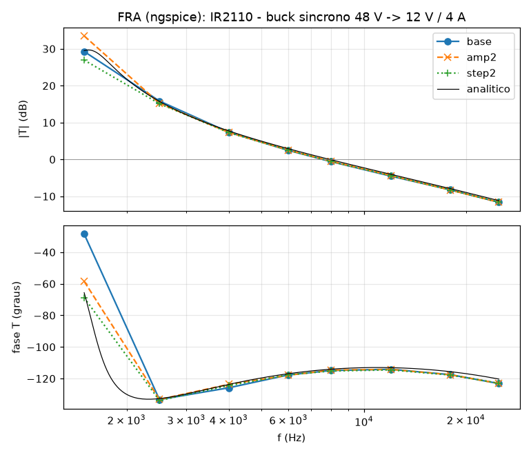

# IR2110 — behavioural SPICE model for LTspice

A functional (`.subckt`) macromodel of the **IR2110 high and low side
driver** (and the IR2113, the same die rated for 600 V), built from the
International Rectifier / Infineon datasheet *PD60147 rev.V (6/3/2019)*.

It is not a transistor-level model. Every block of the Functional Block
Diagram — logic inputs, shutdown latches, level shifter, UVLO, delay chain,
output stages — is reproduced by its **terminal behaviour**, with the numbers
of the TYPICAL column of the Static and Dynamic Electrical Characteristics and
the typical curves (Figures 7–27). The point is to simulate the gate drive of
a half-bridge — bootstrap, dead time, UVLO, cycle-by-cycle shutdown — inside a
closed-loop converter, fast, convergent and **independent of the time step**
(so it works under LTspice's `.FRA`, see below).

## Files

| File | What it is |
|---|---|
| `IR2110.lib` | the model — a single `.subckt IR2110`, heavily commented |
| `IR2110.asy` | LTspice symbol: logic pins on the left, power pins on the right, pins on the 16-unit grid |
| `examples/` | netlists prontos: tempos de comutação, shutdown ciclo a ciclo, partida do bootstrap, buck síncrono em malha fechada |
| `tests/` | datasheet regression tests (see *Verification*) |
| `docs/` | FRA (loop-gain) plot of the closed-loop buck |

## Installing in LTspice

1. Copy `IR2110.lib` and `IR2110.asy` next to your schematic (or into
   `Documents\LTspiceXVII\lib\sub` and `...\lib\sym`).
2. Place the symbol with **F2 → (your directory) → IR2110**.
3. The symbol already carries `SYMATTR ModelFile IR2110.lib`, so LTspice pulls
   the model in by itself. In a plain netlist:

```
.include IR2110.lib
*  LO COM VCC VS VB HO VDD HIN SD LIN VSS
X1 lo 0   vcc sw vb ho vdd hin sd lin 0  IR2110
```

### What to put on the schematic

```
.tran 0 <stop> 0 <maxstep>        e.g.  .tran 0 8m 0 20n
.options method=gear              (for half-bridges with MOSFETs)
```

The model has no oscillator of its own, so it does not *need* a step limit to
be correct. Its edges are 10–30 ns long; with the driver inside a converter,
the converter's own step limit (a fiftieth to a hundredth of the switching
period) is enough. Two habits from the other examples of this library apply
to every half-bridge:

* **`method=gear`** — with trapezoidal integration an ideal-ish power stage
  "rings" numerically at every commutation;
* **`uic`** on the `.tran` of a closed-loop converter — the `.op` of a
  switching converter has no physical meaning (the whole loop would be
  evaluated in DC), and the real supply starts from discharged capacitors
  anyway.

**Bootstrap diode**: the IR2110 has none inside; use your own (an ultrafast
diode). In ngspice, leave the diode's transit time `TT` out: the abrupt
reverse recovery of a few tens of ns, every cycle, occasionally collapses the
time step ("timestep too small") without changing anything in the circuit.
The examples also model the MOSFETs as a small subcircuit (level-1 MOSFET
plus explicit C<sub>gs</sub>, C<sub>gd</sub>, C<sub>ds</sub> and body diode)
instead of `VDMOS`: ngspice's VDMOS occasionally hit the same "timestep too
small" on fast gate edges in long runs. In LTspice either works.

## Pinout

The port order is the 14-lead PDIP pin order, with the three unconnected pins
(4, 8, 14) left out:

| # | Name | Function | | # | Name | Function |
|---:|---|---|---|---:|---|---|
| 1 | `LO` | low-side gate drive | | 9 | `VDD` | logic supply |
| 2 | `COM` | low-side return | | 10 | `HIN` | high-side logic input (in phase) |
| 3 | `VCC` | low-side supply | | 11 | `SD` | shutdown input |
| 5 | `VS` | high-side floating return | | 12 | `LIN` | low-side logic input (in phase) |
| 6 | `VB` | high-side floating supply | | 13 | `VSS` | logic ground |
| 7 | `HO` | high-side gate drive | | | | |

The 16-lead SOIC (IR2110S) has the same signals on other pin numbers — the
same subcircuit, connected by name.

Three grounds: the logic side is referred to **VSS** (which may sit ±5 V away
from COM), LO to **COM**, HO to **VS** (the floating half-bridge node, up to
500 / 600 V).

## How each block is modelled

| Block | Model | From the datasheet |
|---|---|---|
| Logic inputs HIN, LIN, SD | CMOS Schmitt triggers referred to VSS: rise at 0.633·V<sub>DD</sub>, fall at 0.40·V<sub>DD</sub>; 750 kΩ pull-down; clamp diodes to VDD/VSS | V<sub>IH</sub> / V<sub>IL</sub> limits of Figures 12B / 13B (9.5 / 6.0 V at 15 V, 3.2 / 2.0 V at 5 V); I<sub>IN+</sub> = 20 µA |
| Cycle-by-cycle shutdown | one RS latch per channel: set by SD, reset by its input going low; SD path 16 ns slower than the input path | Figure 1, block diagram; t<sub>sd</sub> = 110 ns |
| UVLO | V<sub>CC</sub> 8.5 / 8.2 V and V<sub>BS</sub> 8.6 / 8.2 V, with hysteresis. A V<sub>CC</sub> fault holds LO low; a V<sub>CC</sub> or V<sub>BS</sub> fault holds HO low **until the next rising edge of HIN** (the high side is set by edge pulses through the level shifter) | V<sub>CCUV±</sub>, V<sub>BSUV±</sub> typ |
| Delay | linear ramp to the switching point: t<sub>on</sub> / t<sub>off</sub> = 120 / 94 ns at V<sub>DD</sub> = V<sub>BIAS</sub> = 15 V, scaled with V<sub>DD</sub> (3.5 / 5 / 10 / 15 / 20 V) and V<sub>BIAS</sub> (10…20 V); HO and LO share it (matched) | Figures 7B/7C, 8B/8C, 9B/9C |
| Pre-driver | the gate of each output device is ramped (t<sub>r</sub> / t<sub>f</sub> set mostly here), the device that turns off is released first: no cross-conduction | t<sub>r</sub> 25 ns, t<sub>f</sub> 17 ns typ; Figures 10B / 11B |
| Output stages | I = I<sub>sat</sub>·tanh(V/V<sub>0</sub>) pull-up and pull-down; I<sub>sat</sub> = 2.5 A at 15 V, 1.45 A at 10 V, 3.55 A at 20 V; V<sub>0</sub> = V<sub>BIAS</sub>/2; body diodes to the rails | I<sub>O+</sub>, I<sub>O−</sub>; Figures 26B / 27B |
| Supply currents | I<sub>QCC</sub> 180 µA, I<sub>QBS</sub> 125 µA, I<sub>QDD</sub> 15 µA at 15 V with the shape of Figures 17B–19B; the gate charge of HO comes out of VB (the bootstrap capacitor) | quiescent currents, typ |

### How the timing was fitted

The datasheet gives, at V<sub>BIAS</sub> = 15 V and C<sub>L</sub> = 1 nF, a
propagation delay (input 50 % → output 10 % / 90 %) and a 10–90 % edge. A
2.5 A current source would charge 1 nF to 12 V in 5 ns — the 25 ns rise time
is not set by the output current but by how fast the output device's gate is
driven. So the model ramps the "gate" of each output device (`TER`, `TEF`)
and the output stage follows; the delay ramp in front of it is shortened by
the share the output stage takes (`TOON`, `TOOF`). Fitted per V<sub>BIAS</sub>
column:

| V<sub>BIAS</sub> | 10 V | 15 V | 20 V |
|---|---|---|---|
| pull-up gate ramp `TER` (ns) | 75.5 | 69.2 | 57.1 |
| pull-down gate ramp `TEF` (ns) | 3.6 | 32.1 | 79.8 |
| output share of t<sub>on</sub> / t<sub>off</sub> (ns) | 13.9 / 5.6 | 12.4 / 9.2 | 11.0 / 12.5 |

(t<sub>f</sub> *grows* with V<sub>BIAS</sub> in Figure 11B, 9 → 26 ns, while
the sink current grows too — hence the very different `TEF` column.)

Because the delay and the edges come from a real driver charging a real
capacitance, t<sub>on</sub>, t<sub>off</sub>, t<sub>r</sub> and t<sub>f</sub>
**grow with your gate charge**.

## Everything is a parameter

```
X1 … IR2110 KD=1.3 KE=1.8        ; close to the MAX column at 25 C
```

| Parameter | Default | Meaning |
|---|---|---|
| `KD` | 1 | delay factor (1 = typical, 1.3 ≈ max column) |
| `KE` | 1 | rise/fall-time factor (1 = typical, 1.8 ≈ max column) |
| `VIHF`, `VILF` | 0.633, 0.40 | input thresholds as fractions of V<sub>DD</sub>−V<sub>SS</sub> |
| `RIN`, `CIN` | 750 kΩ, 2 pF | input pull-down; input capacitance (not in the datasheet) |
| `COUT` | 10 pF | HO / LO pin capacitance (not in the datasheet) |
| `UVCCP`, `UVCCN` | 8.5, 8.2 V | V<sub>CC</sub> UVLO thresholds |
| `UVBSP`, `UVBSN` | 8.6, 8.2 V | V<sub>BS</sub> UVLO thresholds |
| `TON`, `TOFF`, `TSD` | 120, 94, 110 ns | t<sub>on</sub>, t<sub>off</sub>, t<sub>sd</sub> at V<sub>DD</sub> = V<sub>BIAS</sub> = 15 V |
| `KBON`, `KBOFF` | 0.167, 0.183 | change of t<sub>on</sub> / t<sub>off</sub> per −5 V of V<sub>BIAS</sub> (Figures 7B, 8B) |
| `DON*`, `DOFF*` | table | t<sub>on</sub> / t<sub>off</sub> factor at V<sub>DD</sub> = 3.5 / 5 / 10 / 20 V (Figures 7C, 8C) |
| `TER*`, `TEF*`, `TOON*`, `TOOF*`, `TFAST` | table above | fitted gate ramps — change only to re-fit |
| `IO`, `KIO`, `KV0` | 2.5 A, 0.42, 0.5 | output current at 15 V, its change per +5 V, knee as a fraction of V<sub>BIAS</sub> |
| `IQCC`, `IQBS`, `IQDD` | 180 µA, 125 µA, 15 µA | quiescent currents at 15 V |

## Verification

`tests/` holds a datasheet-driven regression suite. It runs under **ngspice**,
which needs the PSpice-style `PARAMS:` keyword on the `.subckt` line — the
only difference from the LTspice file; `run_tests.sh` generates the ngspice
copy.

```
cd tests && ./run_tests.sh
```

All 26 checks pass. What they pin down (V<sub>BIAS</sub> = 15 V, 25 °C typical
unless noted):

| Measured | Model | Datasheet |
|---|---|---|
| Input switching points, V<sub>DD</sub> = 15 / 5 / 3.3 V | up 9.51 / 3.17 / 2.09 V, down 5.99 / 2.00 / 1.32 V | V<sub>IH</sub> ≤ 9.5 / 3.2 / 2.1 V, V<sub>IL</sub> ≥ 6.0 / 2.0 / 1.3 V (Figs. 12B, 13B) |
| Input bias current | 20 µA at V<sub>DD</sub>, 0 at 0 V | I<sub>IN+</sub> 20 µA typ, I<sub>IN−</sub> ≤ 1 µA |
| HO / LO in phase with HIN / LIN; SD over a rising edge; SD released with the input high; 100 ns SD pulse | outputs off until the next rising edge | Figure 1 |
| V<sub>CC</sub> UVLO | on 8.50 V, off 8.20 V | 8.5 / 8.2 V typ |
| V<sub>BS</sub> UVLO | HO starts at the first HIN edge after 8.6 V, stops at 8.2 V | 8.6 / 8.2 V typ |
| HIN high while V<sub>BS</sub> recovers | HO waits for the next rising edge | level shifter set by edges |
| t<sub>on</sub> / t<sub>off</sub> / t<sub>r</sub> / t<sub>f</sub> | 120.2 / 93.9 / 25.0 / 17.0 ns | 120 / 94 / 25 / 17 ns typ |
| t<sub>sd</sub> | 110 ns | 110 ns typ |
| delay matching HO / LO | 0 ns | MT ≤ 10 ns |
| V<sub>BIAS</sub> = 10 V | 140 / 111 / 28 / 9.3 ns | Figs. 7B / 8B / 10B / 11B: 140 / 110 / 28 / 9 ns |
| V<sub>BIAS</sub> = 20 V | 101 / 77 / 22 / 26 ns | 100 / 76 / 22 / 26 ns |
| V<sub>DD</sub> = 5 V | t<sub>on</sub> 145 ns, t<sub>off</sub> 148 ns | Figs. 7C / 8C: ~140 / ~150 ns |
| `KD=1.3 KE=1.8` | 150 / 117 / 34 / 23 ns | max 150 / 125 / 35 / 25 ns |
| I<sub>O+</sub> / I<sub>O−</sub> at 10 / 15 / 20 V | 1.45 / 2.5 / 3.55 A | Figs. 26B / 27B: ~1.5 / 2.5 / 3.6 A (2.0 A min at 15 V) |
| V<sub>OH</sub> drop / V<sub>OL</sub> at I<sub>O</sub> = 0 | ~0 / ~0 | ≤ 1.2 V / ≤ 0.1 V |
| I<sub>QCC</sub> / I<sub>QBS</sub> / I<sub>QDD</sub> | 180 / 125 / 15 µA | typ |
| V<sub>SS</sub> = +5 V and −5 V from COM | LO follows LIN referred to VSS | recommended ±5 V |
| V<sub>S</sub> = 500 V | HO switches between V<sub>S</sub> and V<sub>B</sub> | floating channel |
| Charge drawn from VB per HO turn-on, 1 nF | 14.7 nC | 15 V × 1 nF |

## Exemplos

Cada exemplo em `examples/` é simulado e conferido por
`examples/run_examples.sh` (o buck leva ~4 min; os outros, segundos):

| Exemplo | O que mostra | Resultado medido |
|---|---|---|
| `01_tempos_de_comutacao.cir` | circuito de teste da Figura 3, com o lado alto em 0 V e a 400 V | t<sub>on</sub> 120 ns, t<sub>off</sub> 94 ns, t<sub>r</sub> 25 ns, t<sub>f</sub> 17 ns, iguais com V<sub>S</sub> = 400 V |
| `02_shutdown_ciclo_a_ciclo.cir` | SD cortando pulsos de HIN/LIN (Figura 1) | o pulso é cortado e a saída só volta na borda seguinte |
| `03_partida_bootstrap.cir` | meia-ponte de 48 V partindo com o bootstrap descarregado | o 1º pulso de HIN é bloqueado pelo UVLO do lado alto; V<sub>BS</sub> = 14,1–14,4 V em regime |
| `04_buck_sincrono.cir` | buck síncrono 48 V → 12 V / 4 A, 100 kHz, malha fechada (compensação tipo III), partida suave e degrau de carga 4 A → 2 A | 12,00 V, ondulação 41 mV pp, pico de 39 mV no degrau, V<sub>BS</sub> ≥ 15,0 V; ponto de injeção do FRA |

```
cd examples && ./run_examples.sh                          # todos
cd examples && ./run_examples.sh 04_buck_sincrono.cir     # um so
```

Duas observações didáticas:

* **O IR2110 não tem tempo morto.** HIN e LIN chegam complementares e já com
  o tempo morto (no exemplo 04, um RC de 200 ns e duas portas
  comportamentais). Como t<sub>on</sub> ≈ t<sub>off</sub>, o atraso do driver
  quase não muda o tempo morto que você deu — ao contrário do IR2111.
* **Bootstrap e UVLO do lado alto:** com o capacitor de bootstrap
  descarregado, HO não sai mesmo com HIN chaveando; depois que V<sub>BS</sub>
  passa de 8,6 V, HO só começa na próxima borda de subida de HIN
  (exemplo 03). O mesmo vale depois de um afundamento de V<sub>BS</sub>.

## LTspice .FRA (loop gain)

The IR2110 sits *inside* the loop of any converter it drives: PWM → HIN / LIN
→ HO / LO → MOSFET gates. `04_buck_sincrono.cir` has a 0 V source `Vinj` in
series between the output and the feedback network (low impedance → high
impedance, the Middlebrook injection point): **in LTspice, replace `Vinj` with
the FRA component** and run `.fra`.

The repository's `tools/fra/` emulates that analysis in ngspice (see the
top-level README): a single transient, one tone at a time after the loop has
settled, loop gain T = −V(ret)/V(out) by Fourier transform, run three times —
nominal, **twice the injection amplitude**, and **half the time step** — and
compared with the averaged small-signal model of the same loop (type III
compensator × V<sub>IN</sub>/V<sub>ramp</sub> × LC filter with its losses).

Result for the buck (100 kHz, crossover designed at 7.9 kHz):

| f (Hz) | \|T\| (dB) | phase | SNR (dB) | Δ 2× amplitude | Δ dt/2 | analytic \|T\| / phase |
|---:|---:|---:|---:|---:|---:|---:|
| 1500 | 29.28 | −28.5° | −8.3 | *(not judged)* | *(not judged)* | 29.51 / −65.6° |
| 2500 | 15.84 | −133.3° | 20.0 | 0.62 dB / 0.1° | 0.73 dB / 0.5° | 15.73 / −132.7° |
| 4000 | 7.39 | −125.8° | 38.6 | 0.05 dB / 2.2° | 0.10 dB / 1.4° | 7.74 / −123.7° |
| 6000 | 2.44 | −117.7° | 40.9 | 0.09 dB / 0.2° | 0.08 dB / 0.1° | 2.90 / −116.9° |
| 8000 | −0.58 | −114.9° | 35.4 | 0.09 dB / 0.3° | 0.03 dB / 0.3° | −0.08 / −114.1° |
| 12000 | −4.52 | −114.1° | 48.8 | 0.17 dB / 0.1° | 0.12 dB / 0.4° | −4.02 / −113.1° |
| 18000 | −8.25 | −117.5° | 50.7 | 0.05 dB / 0.1° | 0.02 dB / 0.2° | −7.91 / −115.6° |
| 25000 | −11.63 | −123.1° | 52.0 | 0.02 dB / 0.1° | 0.04 dB / 0.1° | −11.19 / −120.3° |

**PASS — crossover 7.57 kHz, phase margin 64.6°.** Doubling the injection or
halving the step moves the result by at most 0.73 dB / 2.2° on the seven
points with SNR ≥ 20 dB, and it matches the averaged small-signal loop gain
within 0.50 dB. At 1.5 kHz the loop gain is ~30 dB: the signal left at
V(out) is a fraction of a millivolt, buried in the 100 kHz ripple — that point
is below the tool's 20 dB SNR floor in any FRA, LTspice's included, and is
not judged.

```
python3 tools/fra/fra_ngspice.py tools/fra/configs/ir2110_buck.py   # ~25 min
```



Why it behaves: no time-dependent sources and no oscillator inside; every
Schmitt trigger, UVLO and latch is an integrating set/reset cell whose only DC
solutions are 0 and 1; every delay and edge is a finite-slope ramp written as
*target − y*, with y = 0 at DC, so the operating point needs no search and the
edges move continuously with the input. Getting there took two lessons that
are worth knowing for any behavioural model:

* a slew-limited node written the obvious way (a saturating current into a
  capacitor) has **zero conductance when saturated**, and Newton can then
  oscillate forever while looking for the `.op`;
* a piecewise function (`min`, `max`, clipping) whose **kink sits exactly where
  a node rests** makes Newton jump between the two sides of the kink when the
  node starts to move — in a long switching run that shows up as a rare
  "timestep too small". The model blends such slopes smoothly (`tanh`) and
  keeps every kink away from the rest states.

## What is *not* modelled

* **No temperature model.** `KD` / `KE` scale the delays and edges; the
  UVLO thresholds and currents do not move.
* **No bootstrap diode** inside (the IR2110 has none).
* **Offset supply leakage** (I<sub>LK</sub> ≤ 50 µA at 500 V), **dV<sub>S</sub>/dt**
  immunity and level-shifter false triggering, **negative V<sub>S</sub>**
  transients and latch-up are not modelled. The 500 / 600 V and 25 V ratings
  are not policed.
* **Input thresholds at the guaranteed limits** (V<sub>IH</sub> max,
  V<sub>IL</sub> min): a real part switches somewhere in between.
* With **V<sub>DD</sub> − V<sub>SS</sub> below ~2.5 V** the logic is taken as
  dead and both outputs are held low (not specified in the datasheet); with
  V<sub>BIAS</sub> under the UVLO the outputs are actively held low down to
  0 V of supply.
* **V<sub>OH</sub>** comes out at the rail (the datasheet only bounds it to
  1.2 V).

## Licence

Public domain / CC0. No warranty — check anything safety-critical against
hardware.
