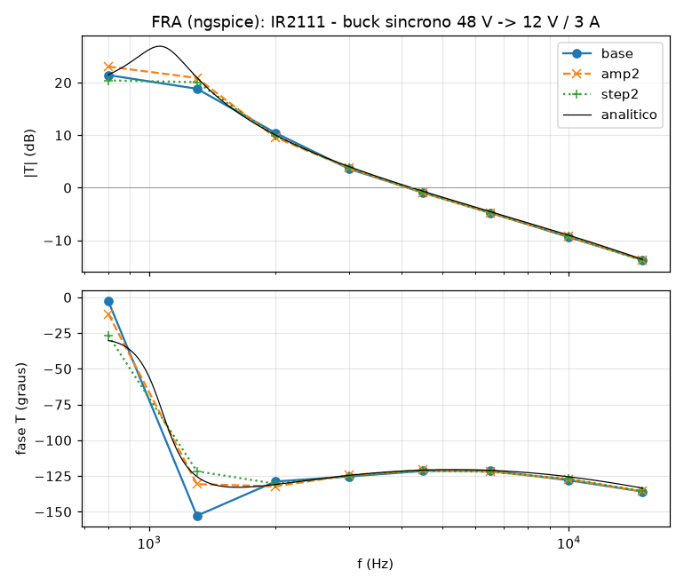

# IR2111 — behavioural SPICE model for LTspice

A functional (`.subckt`) macromodel of the **IR2111 half-bridge driver** —
one logic input, two outputs, internal dead time — built from the
International Rectifier datasheet *PD-6.028C* (Control Integrated Circuit
Designers' Manual, B-39…B-45).

It is not a transistor-level model. Every block of the Functional Block
Diagram — Schmitt input, the two dead-time blocks, UVLO, level shifter,
output stages — is reproduced by its **terminal behaviour**, with the numbers
of the TYPICAL column of the Static and Dynamic Electrical Characteristics.
The point is to simulate a half-bridge driven from a single PWM signal — the
classic ballast / motor / class-D topology — inside a closed loop, fast,
convergent and **independent of the time step** (so it works under LTspice's
`.FRA`, see below).

## Files

| File | What it is |
|---|---|
| `IR2111.lib` | the model — a single `.subckt IR2111`, heavily commented |
| `IR2111.asy` | LTspice symbol: VCC / IN / COM on the left, VB / HO / VS / LO on the right, pins on the 16-unit grid |
| `examples/` | netlists prontos: tempo morto, meia-ponte com carga indutiva, buck síncrono em malha fechada |
| `tests/` | datasheet regression tests (see *Verification*) |
| `docs/` | FRA (loop-gain) plot of the closed-loop buck |

## Installing in LTspice

1. Copy `IR2111.lib` and `IR2111.asy` next to your schematic (or into
   `Documents\LTspiceXVII\lib\sub` and `...\lib\sym`).
2. Place the symbol with **F2 → (your directory) → IR2111**.
3. The symbol already carries `SYMATTR ModelFile IR2111.lib`, so LTspice pulls
   the model in by itself. In a plain netlist:

```
.include IR2111.lib
*  VCC IN COM LO VS HO VB
X1 vcc in 0   lo sw ho vb IR2111
```

### What to put on the schematic

```
.tran 0 <stop> 0 <maxstep>        e.g.  .tran 0 12m 0 40n
.options method=gear              (for half-bridges with MOSFETs)
```

Same habits as the other drivers of this library: `method=gear` for any
half-bridge, `uic` on the `.tran` of a closed-loop converter, your own
bootstrap diode (none inside) without a transit time `TT` in ngspice.

**The input is CMOS referred to VCC**, not a 5 V logic input: it switches at
V<sub>IH</sub> = 9.5 V / V<sub>IL</sub> = 6.0 V with V<sub>CC</sub> = 15 V.
Drive it with a 0…V<sub>CC</sub> signal (or use the IR2110 / IR2113 for
3.3 / 5 V logic).

## Pinout

The port order is the 8-lead pin order (DIP and SO-8 are the same), with the
unconnected pin 5 left out:

| # | Name | Function |
|---:|---|---|
| 1 | `VCC` | low-side and logic supply |
| 2 | `IN` | logic input — in phase with HO, inverted on LO |
| 3 | `COM` | low-side and logic return |
| 4 | `LO` | low-side gate drive |
| 6 | `VS` | high-side floating return (the half-bridge node) |
| 7 | `HO` | high-side gate drive |
| 8 | `VB` | high-side floating supply |

IN high → HO on, LO off; IN low → LO on, HO off (Figure 1), with the dead
time between them.

## How each block is modelled

| Block | Model | From the datasheet |
|---|---|---|
| Logic input IN | CMOS Schmitt trigger referred to COM: rises at 0.62·V<sub>CC</sub> + 0.2 V, falls at 0.45·V<sub>CC</sub> − 0.7 V; 750 kΩ pull-down; clamp diodes | V<sub>IH</sub> 6.4 / 9.5 / 12.6 V, V<sub>IL</sub> 3.8 / 6.0 / 8.3 V at V<sub>CC</sub> = 10 / 15 / 20 V; I<sub>IN+</sub> = 20 µA |
| Dead time | each output turns on t<sub>on</sub> = 850 ns and off t<sub>off</sub> = 150 ns after the input edge, so DT = t<sub>on</sub> − t<sub>off</sub> = 700 ns (from 90 % of the falling output to 10 % of the rising one); a linear ramp, so an input pulse shorter than ~t<sub>on</sub> is swallowed | t<sub>on</sub>, t<sub>off</sub>, DT typ; Figure 5 |
| UVLO | V<sub>CC</sub> 8.6 / 8.2 V (both outputs), V<sub>BS</sub> 8.4 / 8.1 V (HO), with hysteresis; after a fault HO waits for the next rising edge of IN, LO follows IN as soon as V<sub>CC</sub> is good | V<sub>CCUV±</sub>, V<sub>BSUV±</sub> typ |
| Pre-driver and outputs | the gate of each output device is ramped, the one that turns off is released first (no cross-conduction); I = I<sub>sat</sub>·tanh(V/V<sub>0</sub>), I<sub>sat</sub> = 250 mA source / 500 mA sink at 15 V, V<sub>0</sub> = V<sub>BIAS</sub>/2 | I<sub>O+</sub> 250 mA, I<sub>O−</sub> 500 mA typ; t<sub>r</sub> 80 ns, t<sub>f</sub> 40 ns typ |
| Supply currents | I<sub>QCC</sub> 70 µA, I<sub>QBS</sub> 50 µA at 15 V; the gate charge of HO comes out of VB | typ |

Unlike the IR2110, the IR2111's 250 mA output *is* what limits its edges: the
pull-up alone, fully on, needs 78 ns to take 1 nF from 10 % to 90 % of 15 V;
the fitted gate ramps (27.5 ns up, 13.7 ns down) only add the rest. The
datasheet gives no curves against V<sub>CC</sub> or temperature, so the delays
do not change with V<sub>CC</sub>; the output current is scaled with
V<sub>BIAS</sub> by the law of the IR2110 (an assumption).

## Everything is a parameter

```
X1 … IR2111 KD=1.2 KE=1.6        ; close to the MAX column at 25 C
```

| Parameter | Default | Meaning |
|---|---|---|
| `KD` | 1 | delay factor (1 = typical, 1.2 ≈ max column: t<sub>on</sub> 1 µs, DT 830 ns) |
| `KE` | 1 | rise/fall-time factor |
| `VIHA`, `VIHB` | 0.62, 0.2 V | rising threshold = `VIHA`·V<sub>CC</sub> + `VIHB` |
| `VILA`, `VILB` | 0.45, −0.7 V | falling threshold = `VILA`·V<sub>CC</sub> + `VILB` |
| `RIN`, `CIN`, `COUT` | 750 kΩ, 2 pF, 10 pF | input pull-down; input and output capacitances (not in the datasheet) |
| `UVCCP`, `UVCCN` | 8.6, 8.2 V | V<sub>CC</sub> UVLO |
| `UVBSP`, `UVBSN` | 8.4, 8.1 V | V<sub>BS</sub> UVLO |
| `TON`, `TOFF` | 850, 150 ns | t<sub>on</sub>, t<sub>off</sub> into 1 nF |
| `TER`, `TEF`, `TOON`, `TOOF`, `TFAST` | 27.5, 13.7, 33.3, 12.6, 3 ns | fitted gate ramps — change only to re-fit |
| `ISU`, `ISD` | 0.25, 0.5 A | output short-circuit currents at 15 V |
| `KIO`, `KV0` | 0.42, 0.5 | output-current change per +5 V of V<sub>BIAS</sub>; knee as a fraction of V<sub>BIAS</sub> |
| `IQCC`, `IQBS` | 70 µA, 50 µA | quiescent currents at 15 V |

## Verification

`tests/` holds a datasheet-driven regression suite, run under **ngspice**
(`run_tests.sh` adds the `PARAMS:` keyword ngspice needs — the only
difference from the LTspice file):

```
cd tests && ./run_tests.sh
```

All 22 checks pass. What they pin down (V<sub>BIAS</sub> = 15 V, C<sub>L</sub> =
1 nF, typical, unless noted):

| Measured | Model | Datasheet |
|---|---|---|
| Input switching points at V<sub>CC</sub> = 10 / 15 / 20 V | up 6.40 / 9.50 / 12.60 V, down 3.80 / 6.06 / 8.30 V | V<sub>IH</sub> ≥ 6.4 / 9.5 / 12.6 V, V<sub>IL</sub> ≤ 3.8 / 6.0 / 8.3 V |
| Input bias | 20 µA at V<sub>CC</sub>, 0 at 0 V | I<sub>IN+</sub> 20 µA typ, I<sub>IN−</sub> ≤ 1 µA |
| Function, overlap | HO in phase, LO inverted, never both on | Figure 1 |
| Dead time LO→HO / HO→LO | 699 / 699 ns | DT 700 ns typ, 900 max |
| 300 ns input pulse | HO never turns on, LO blinks off | — |
| V<sub>CC</sub> UVLO | LO on 8.61 V, off 8.20 V | 8.6 / 8.2 V typ |
| V<sub>BS</sub> UVLO | HO starts at the first IN edge after 8.4 V, stops at 8.1 V | 8.4 / 8.1 V typ |
| IN high while V<sub>BS</sub> recovers; V<sub>CC</sub> drop | HO waits for the next edge; HO off as well | — |
| t<sub>on</sub> / t<sub>off</sub> / t<sub>r</sub> / t<sub>f</sub>, HO and LO | 850 / 150 / 80 / 40 ns | 850 / 150 / 80 / 40 ns typ |
| delay matching HS / LS | 0.5 ns | MT 30 ns typ |
| `KD=1.2 KE=1.6` | t<sub>on</sub> 1007 ns, t<sub>off</sub> 175 ns, DT 831 ns | max 1000 / 180 / 900 ns |
| 3.3 nF load | t<sub>on</sub> 865 ns, t<sub>r</sub> 257 ns | grow with the load |
| I<sub>O+</sub> / I<sub>O−</sub>, HO and LO | 250 / 500 mA | 250 / 500 mA typ (200 / 420 min) |
| V<sub>OH</sub> drop / V<sub>OL</sub> at I<sub>O</sub> = 0 | ~0 / ~0 | ≤ 100 mV |
| I<sub>QCC</sub> / I<sub>QBS</sub> | 70 / 50 µA | typ |
| V<sub>S</sub> = 600 V | HO switches between V<sub>S</sub> and V<sub>B</sub> | floating channel |
| Charge drawn from VB per HO turn-on, 1 nF | 15.3 nC | 15 V × 1 nF |

## Exemplos

Cada exemplo em `examples/` é simulado e conferido por
`examples/run_examples.sh`:

| Exemplo | O que mostra | Resultado medido |
|---|---|---|
| `01_tempo_morto.cir` | circuito de teste das Figuras 3–5: uma entrada, duas saídas | t<sub>on</sub> 850 ns, t<sub>off</sub> 150 ns, DT 699 ns nas duas bordas; um pulso de 400 ns não liga HO |
| `02_meia_ponte_indutiva.cir` | meia-ponte de 200 V, 25 kHz, carga RL ligada ao ponto médio | ±1 A na carga; no tempo morto a corrente vira o nó de comutação pelo diodo de corpo **antes** do outro MOSFET ligar (comutação suave) |
| `03_buck_sincrono.cir` | buck síncrono 48 V → 12 V / 3 A, 50 kHz, malha fechada com uma única entrada PWM, partida suave e degrau de carga 3 A → 1,5 A | 12,00 V, ondulação 57 mV pp, pico de 0,21 V no degrau; ponto de injeção do FRA |

```
cd examples && ./run_examples.sh                            # todos
cd examples && ./run_examples.sh 03_buck_sincrono.cir       # um so
```

Duas observações didáticas:

* **O tempo morto come a largura do pulso de HO.** Cada pulso de HO é
  t<sub>on</sub> − t<sub>off</sub> = 0,7 µs mais curto que o pulso de IN (3,5 %
  do período a 50 kHz). No buck do exemplo 03 a malha corrige sozinha: o PWM
  fica em ~28,6 % para HO ficar em ~25 %.
* **No tempo morto quem conduz é o diodo de corpo.** No buck, a corrente do
  indutor passa pelo diodo de M2 nos dois tempos mortos (~1,2 µs por ciclo
  com o nó em −0,8 V); na meia-ponte com carga indutiva, é essa corrente que
  vira o nó antes do outro MOSFET ligar.

## LTspice .FRA (loop gain)

`03_buck_sincrono.cir` has a 0 V source `Vinj` in series between the output
and the feedback network: **in LTspice, replace `Vinj` with the FRA
component** and run `.fra`. The IR2111 is inside the loop (PWM → IN → HO / LO
with the internal dead time → MOSFET gates).

The repository's `tools/fra/` emulates the analysis in ngspice (see the
top-level README) — nominal, **twice the injection amplitude**, **half the
time step** — and compares it with the averaged small-signal model of the same
loop:

Result for the buck (50 kHz, crossover designed at 4.2 kHz):

| f (Hz) | \|T\| (dB) | phase | SNR (dB) | Δ 2× amplitude | Δ dt/2 | analytic \|T\| / phase |
|---:|---:|---:|---:|---:|---:|---:|
| 800 | 21.43 | −2.9° | −10.9 | *(not judged)* | *(not judged)* | 21.51 / −30.3° |
| 1300 | 18.83 | −152.8° | −1.5 | *(not judged)* | *(not judged)* | 20.97 / −125.4° |
| 2000 | 10.44 | −128.9° | 11.2 | *(not judged)* | *(not judged)* | 10.04 / −130.9° |
| 3000 | 3.58 | −125.3° | 31.4 | 0.15 dB / 0.9° | 0.18 dB / 0.4° | 4.01 / −124.5° |
| 4500 | −0.93 | −121.5° | 34.3 | 0.05 dB / 0.7° | 0.03 dB / 0.1° | −0.67 / −120.9° |
| 6500 | −4.74 | −121.2° | 51.9 | 0.04 dB / 0.8° | 0.06 dB / 0.8° | −4.51 / −121.0° |
| 10000 | −9.39 | −128.0° | 47.6 | 0.14 dB / 0.7° | 0.15 dB / 1.0° | −9.03 / −125.5° |
| 15000 | −13.70 | −135.9° | 55.1 | 0.14 dB / 0.1° | 0.15 dB / 0.3° | −13.64 / −133.5° |

**PASS — crossover 4.14 kHz, phase margin 57.7°.** Doubling the injection or
halving the step moves the result by at most 0.18 dB / 1.0° on the five
points with SNR ≥ 20 dB, and it matches the averaged small-signal loop gain
within 0.42 dB. Below 2.5 kHz the loop gain is 10–27 dB and the signal at
V(out) sinks into the 50 kHz ripple (SNR < 20 dB): those points are not
judged.

```
python3 tools/fra/fra_ngspice.py tools/fra/configs/ir2111_buck.py   # ~25 min
```



The 700 ns dead time is a fixed duty offset, so it does not change the
small-signal gain V<sub>IN</sub>/V<sub>ramp</sub> of the modulator; the
150 ns t<sub>off</sub> on the modulated (trailing) edge adds 0.2° of phase at
4 kHz. Why the model is robust: the same construction as the IR2110 —
integrating set/reset cells for every state bit, *target − y* ramps for every
delay and edge, no kinks where a node rests (see the IR2110 README).

## What is *not* modelled

* **No temperature or V<sub>CC</sub> dependence** of the delays (the
  datasheet has no curves); `KD` / `KE` scale delays and edges.
* **No bootstrap diode** inside.
* **Offset supply leakage** (I<sub>LK</sub> ≤ 50 µA at 600 V),
  **dV<sub>S</sub>/dt** immunity, **negative V<sub>S</sub>** transients and
  latch-up; the 600 V / 25 V ratings are not policed.
* **Input thresholds at the guaranteed limits** (V<sub>IH</sub> min,
  V<sub>IL</sub> max); a real part switches in between.
* **Delay matching** (MT, 30 ns typ) is not reproduced: HO and LO are
  matched within 1 ns.
* With V<sub>CC</sub> under the UVLO the outputs are actively held low down
  to 0 V of supply (not specified).

## Licence

Public domain / CC0. No warranty — check anything safety-critical against
hardware.
