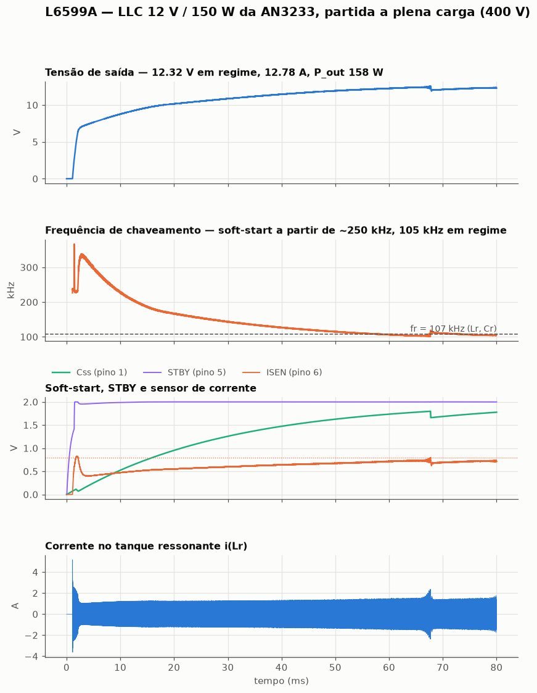
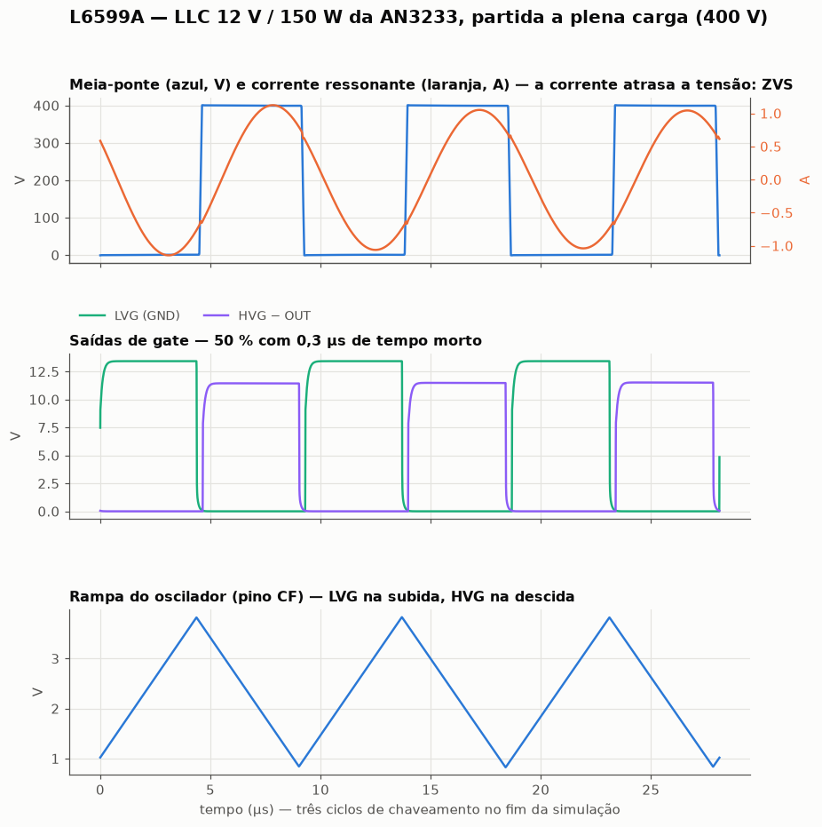
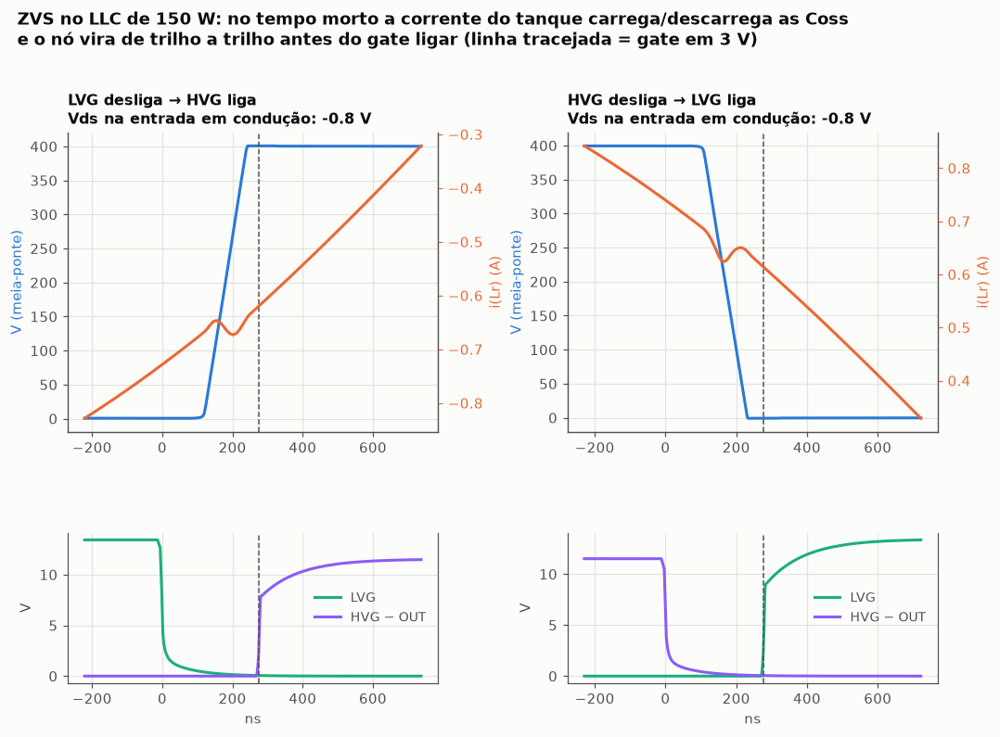
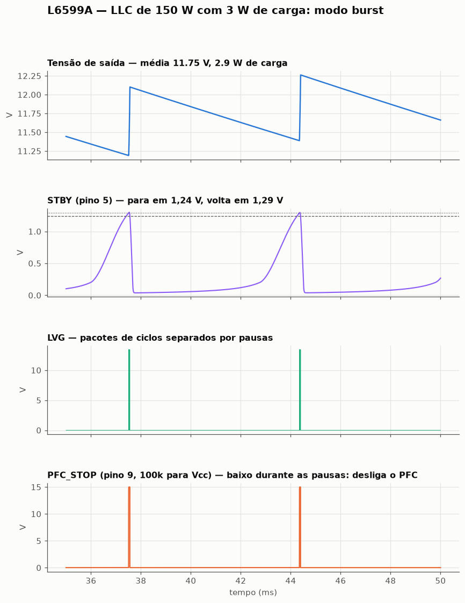
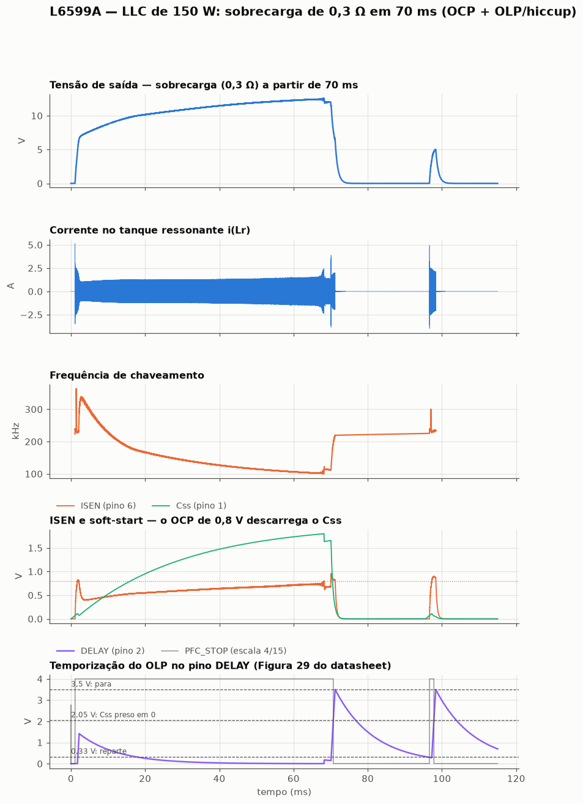
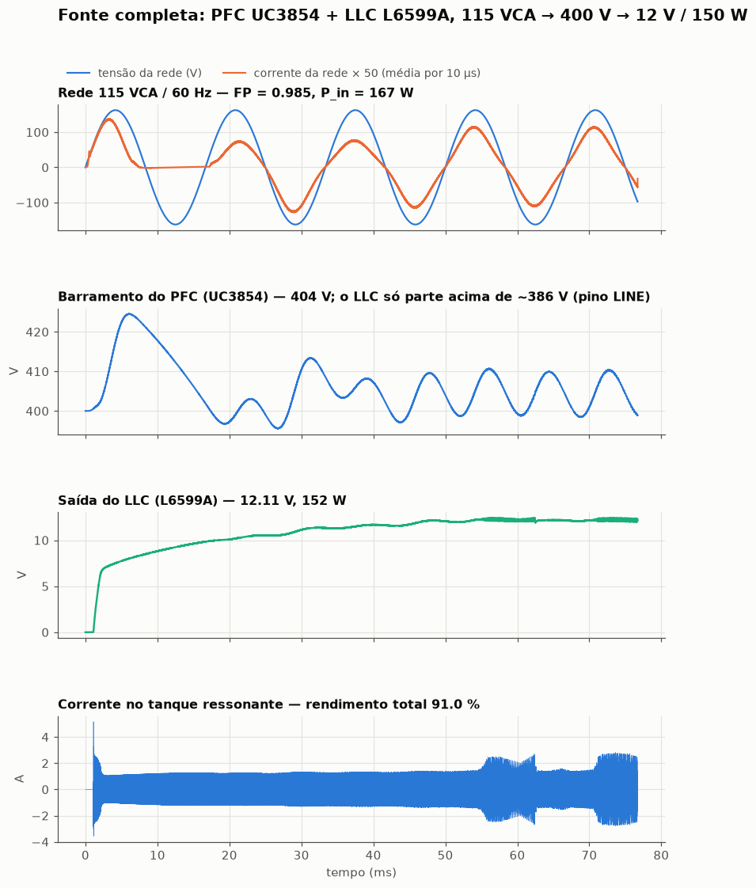

# L6599A (L6599AD / L6599AN) — behavioural SPICE model for LTspice

A functional (`.subckt`) macromodel of the **STMicroelectronics L6599A improved
high-voltage resonant controller**, the half-bridge LLC controller used in TV,
PC and adapter power supplies. It was built from the ST datasheet (Doc ID 15308
Rev 7, January 2013) and application note **AN3233**, *"12 V – 150 W resonant
converter with synchronous rectification using L6563H, L6599A, and SRK2000A"*
(EVL150W-ADP-SR board).

The L6599AD (SO16N) and L6599AN (DIP16) are the same die with the same pinout,
so one model covers both.

It is not a transistor-level model. Every block of the datasheet block diagram
(Figure 1) and of the oscillator diagram (Figure 22) is reproduced by its
**terminal behaviour**, with numbers taken from the Electrical Characteristics
table, the pin descriptions, the typical-characteristic curves and the
Application Information section. The goal is closed-loop LLC simulation: it is
fast, it converges, and it reproduces the specs that matter when you design a
resonant converter around it. It follows the same structure and conventions
as the SG3524 and UC3854 models.

## Files

| File | What it is |
|---|---|
| `L6599A.lib` | the model: a single `.subckt L6599A`, heavily commented |
| `L6599A.asy` | LTspice symbol, 16-pin layout, pin order 1…16 |
| `examples/` | ready-to-run netlists: open loop, the AN3233 150 W LLC (full load, burst, short circuit) and a complete PFC + LLC supply |
| `examples/UC3854.lib` | copy of the UC3854 model (from `UC3854-spice-model`) for the PFC front end of example 05 |
| `tests/` | datasheet regression tests (see *Verification*) |
| `docs/` | plots of the examples |

## Installing in LTspice

1. Copy `L6599A.lib` and `L6599A.asy` next to your schematic (or into
   `Documents\LTspiceXVII\lib\sub` and `...\lib\sym`).
2. Place the symbol with **F2 → (your directory) → L6599A**.
3. The symbol already carries `SYMATTR ModelFile L6599A.lib`, so LTspice pulls
   the model in by itself. If you prefer, add the directive by hand:

```
.include L6599A.lib
```

In a plain netlist:

```
X1 CSS DELAY CF RFMIN STBY ISEN LINE DIS PFC_STOP GND LVG VCC NC OUT HVG VBOOT L6599A
```

### What to put on the schematic

```
.tran 0 <stop> 0 <maxstep>        e.g.  .tran 0 25m 0 40n
```

Set `maxstep` to about **0.5 % of the switching period** (40 ns at 120 kHz).
The dead time (0.3 µs) is produced by an integrator, not by a pulse, so the
model cannot step over it, and every latch is an integrating cell that holds
its state at any step size. The step size is really set by the power stage:
the half-bridge transitions and the ZVS commutation of the resonant current
need it.

## Pinout

| # | Name | Function |
|---:|---|---|
| 1 | `CSS` | soft-start: internal 120 Ω switch to GND that empties the external C<sub>SS</sub> |
| 2 | `DELAY` | OCP delayed shutdown: 150 µA source, thresholds 2.05 / 3.5 / 0.33 V |
| 3 | `CF` | timing capacitor, symmetric triangle ~0.85 … ~3.8 V |
| 4 | `RFMIN` | 2 V reference; the current it **sources** sets the frequency |
| 5 | `STBY` | burst mode: idle below 1.24 V, restart above 1.29 V |
| 6 | `ISEN` | current sense: 0.8 V frequency shift, 1.5 V latch-off |
| 7 | `LINE` | brownout / sequencing: 1.24 V, 13 µA current hysteresis, ~7 V clamp and OV stop |
| 8 | `DIS` | latched disable, 1.85 V |
| 9 | `PFC_STOP` | open drain, stops the PFC controller |
| 10 | `GND` | ground (device reference; **does not have to be node 0**) |
| 11 | `LVG` | low-side gate drive |
| 12 | `VCC` | supply, UVLO 10.7 V on / 8.15 V off, 17 V clamp |
| 13 | `NC` | not connected (high-voltage spacer) |
| 14 | `OUT` | half-bridge node, high-side floating ground |
| 15 | `HVG` | high-side gate drive, referred to OUT |
| 16 | `VBOOT` | high-side floating supply (bootstrap capacitor to OUT) |

Everything inside the model is referenced to `GND` (pin 10), and the high-side
driver to `OUT` (pin 14).

## How each block is modelled

**Oscillator** (Figure 22). RFMIN is held at 2 V and the current it sources,
I<sub>R</sub>, is mirrored into CF with K<sub>M</sub> = 1: CF charges with
I<sub>R</sub> and discharges with 2·I<sub>R</sub> − I<sub>R</sub>, a symmetric
triangle. Everything connected to RFMIN (R<sub>Fmin</sub>, the R<sub>SS</sub>–C<sub>SS</sub>
soft-start branch, the optocoupler through R<sub>Fmax</sub>) acts only through
that current, exactly as on the chip, so

```
f ≈ 1 / (3 · CF · RFmin)          fmax ≈ 1 / (3 · CF · (RFmin // RFmax))       (Eq. 1)
```

The ramp is 2.9 V peak to peak (Figure 10: ~0.85 … ~3.75 V) and each turnaround
has an 80 ns comparator delay. That pair of numbers reproduces **both**
frequencies in Table 5 (60 kHz at 12k/470 pF, 250 kHz at 2.7k/470 pF) and the
~1 MHz top of Figure 9 (1k/220 pF), i.e. the droop below the ideal formula at
high frequency.

**Gate logic** (Figure 23). LVG is on while CF ramps up, HVG while it ramps
down, with a fixed 0.3 µs dead time after each turnaround. When the IC starts
(or resumes after burst idle) the ramp starts going up, so the low side
always switches first and the bootstrap capacitor is charged.

**Soft-start.** The CSS switch (120 Ω) discharges C<sub>SS</sub> whenever the IC
is off (UVLO, LINE out of range, DIS, ISEN latch, DELAY stop), while ISEN > 0.8 V
(until it drops to 0.75 V), and while DELAY is past 2 V. In burst idle it is
left alone ("soft-start is not invoked").

**OCP and OLP** (Section 7.4, Figure 29). ISEN > 0.8 V (50 mV hysteresis):
C<sub>SS</sub> discharged and 150 µA into DELAY. DELAY > 2.05 V: C<sub>SS</sub>
held discharged and the 150 µA kept on. DELAY > 3.5 V: the IC stops, the
generator turns off, PFC_STOP goes low, and the IC soft-restarts when the
external R has brought DELAY below 0.33 V. That state survives a UVLO cycle,
as the datasheet says. ISEN > 1.5 V latches the IC off after ~300 ns until Vcc
drops below UVLO. Both ISEN comparators are blanked for 250 ns after each gate
turns on.

**LINE.** 1.24 V comparator with the 13 µA sink ON below it, so the on and off
bus voltages are set independently by the divider (Eq. 11/12). Internal clamp
~7.3 V at 1 mA; above 7 V the IC stops (not latched).

**DIS** latches at 1.85 V until UVLO. **STBY** (burst): idle below 1.24 V,
running above 1.29 V; in idle both gates are low, CF is parked, only the 2 V
reference stays alive and PFC_STOP is low.

**PFC_STOP.** Open drain (130 Ω), low on DIS, ISEN latch, LINE OV, burst idle
and OLP; open during UVLO and while LINE < 1.24 V.

**Supply.** UVLO 10.7 / 8.15 V, 17 V clamp. 200 µA before start, 300 µA
latched/stopped, 1.5 mA in burst idle, 3.5 mA switching at the datasheet
conditions (1 nF loads, 60 kHz), plus what the IC sources: the RFMIN current
and its mirror, the LVG charge, the bootstrap diode, the DELAY generator.

**Gate drivers.** 13.3 V at −5 mA (Vcc = 15 V), 0.3 A source / 0.8 A sink,
tr ≈ 58 ns / tf ≈ 26 ns into 1 nF, 1.4 V sinking 200 mA. LVG has the UVLO
pull-down (1.1 V at 2 mA with Vcc = 0). HVG is the same stage between VBOOT and
OUT, with the 25 kΩ HVG–OUT pull-down.

**Synchronous bootstrap diode.** 150 Ω + 0.6 V from VCC to VBOOT, on while the
low-side driver is on (Eq. 13: V<sub>Drop</sub> = Q<sub>g</sub>/T<sub>charge</sub>·R<sub>DS(on)</sub> + V<sub>F</sub>).

## Everything is a parameter

Any value in the parameter list on the `.subckt` line can be overridden per
instance, e.g. for a corner run:

```
X1 … L6599A VREF=1.93 VCFH=3.7 VISX=0.77 TDEAD=0.2u
```

Useful ones: `VCCON VCCOFF VZ` (supply), `VREF KM IRFMX` (reference and
mirror), `VCFH VCFL TDOSC` (oscillator), `TDEAD TLEB` (dead time, blanking),
`VISX VISXH VISDIS RSSON` (OCP), `IDLY VDLY1 VDLY2 VDLY3` (OLP), `VLINE ILHYS
VLOV` (LINE), `VDIS VSTBL VSTBH` (DIS, burst), `VDRP ROH ROL ISRC ISNK` (drivers),
`RBOOT VFBOOT` (bootstrap).

## Verification

`tests/` holds a datasheet-driven regression suite. It runs under **ngspice**,
which needs the PSpice-style `PARAMS:` keyword on the `.subckt` line. That one
keyword is the only difference from the LTspice file, and `run_tests.sh`
generates the ngspice copy automatically.

```
cd tests && ./run_tests.sh              # ~10 minutes
```

All 49 checks pass:

| Measured | Model | Datasheet |
|---|---|---|
| VCC turn-on / turn-off | 10.70 / 8.16 V | 10.7 / 8.15 typ |
| Start-up current at VccOn − 0.2 V | 200 µA | 200 typ, 250 max |
| Operating current (60 kHz, 1 nF loads) | 3.57 mA | 3.5 typ, 5 max |
| Quiescent current, burst idle | 1.50 mA | 1.5 typ, 2 max |
| Residual current, DIS latched | 300 µA | 300 typ, 400 max |
| Vcc clamp at 15 mA | 17.0 V | 16 / 17 / 17.9 |
| RFMIN reference, open / at −2 mA | 2.000 / 1.999 V | 1.93 … 2.07 |
| f<sub>osc</sub>, 12k / 470 pF | 59.6 kHz | 58.2 / 60 / 61.8 |
| f<sub>osc</sub>, 2.7k / 470 pF | 245.7 kHz | 240 / 250 / 260 |
| f<sub>osc</sub>, 5k / 470 pF vs Eq. 1 | 138.6 vs 141.8 kHz | "approximate" |
| f<sub>osc</sub>, 1k / 220 pF | 985 kHz | ~1 MHz (Figure 9) |
| CF peak / valley | 3.82 / 0.84 V | 3.9 / 0.9 typ (Fig. 10: ~3.75 / ~0.85) |
| LVG / HVG duty cycle | 50.0 % | 48 … 52 |
| Dead time, both edges | 0.28 µs | 0.2 / 0.3 / 0.4 |
| LVG / HVG high at −5 mA | 13.30 V | 12.8 min, 13.3 typ |
| LVG / HVG low at 200 mA | 1.40 V | 1.5 max |
| Rise / fall, 1 nF | 58 / 26 ns | 60 / 30 typ |
| LVG UVLO pull-down, 2 mA, Vcc = 0 | 1.10 V | 1.1 max |
| Bootstrap diode (15 V → 12 V) | 16 mA = (3 − 0.6)/150 | R<sub>DS(on)</sub> 150 Ω |
| OCP threshold / hysteresis | 0.80 V / 50 mV | 0.8 / 50 mV |
| C<sub>SS</sub> during OCP | 38 mV (120 Ω) | 120 Ω discharge |
| DELAY charge current | 150 µA | 100 / 150 / 200 |
| DELAY past 2.05 V, ISEN back to 0 | generator on, C<sub>SS</sub> held at 0 | Section 7.4 |
| DELAY 3.5 V | stop, PFC_STOP low | 3.35 … 3.65 |
| Restart time with 1 MΩ · 10 nF | 23.58 ms (Eq. 10: 23.61) | restart at 0.33 V |
| ISEN latch delay | 360 ns | 300 typ, 400 max |
| ISEN / DIS latch released by UVLO | yes / yes | "recycle the supply" |
| DIS threshold | 1.850 V | 1.78 / 1.85 / 1.92 |
| LINE threshold / hysteresis current | 1.235 V / 13.07 µA | 1.24 / 13 µA |
| LINE OV stop / clamp at ~1 mA | 7.00 V / 7.33 V | ~7 V / 6 … 8 V |
| PFC_STOP with LINE < 1.24 V | open | open |
| STBY idle / restart | 1.240 / 1.289 V | 1.24 / +50 mV |
| C<sub>SS</sub> during burst idle | kept at 2.0 V | "keeps its charge" |
| First gate after burst idle | LVG | Figure 23 |

## Exemplos (em malha fechada)

```
cd examples && ./run_examples.sh                       # todos (os conversores levam ~1 h cada)
cd examples && ./run_examples.sh 01_malha_aberta.cir
```

| Exemplo | O que e | Resultado |
|---|---|---|
| `01_malha_aberta.cir` | condicoes do datasheet (470 pF / 12k), soft-start e "opto" puxando 0→400 µA do RFMIN | f<sub>start</sub> 166 kHz, f<sub>min</sub> 60 kHz, f<sub>max</sub> ~190 kHz; tempo morto 0,28 µs; duty 50 % |
| `02_llc_150w_an3233.cir` | **o LLC de 12 V / 150 W da AN3233** (EVL150W-ADP-SR), 400 V, plena carga, partida do zero | frequencia de ~330 kHz ate ~105–110 kHz (f<sub>r</sub> = 107 kHz), 12 V em ~55 ms, ZVS nas duas chaves, ISEN ~0,7 V |
| `03_burst_carga_leve.cir` | o mesmo com 3 W de carga | modo burst: STBY cruza 1,24/1,29 V, pacotes a cada ~7 ms, PFC_STOP baixo nas pausas, P<sub>in</sub> 3,5 W |
| `04_sobrecarga_hiccup.cir` | o mesmo, carga vai a 0,3 Ω em 70 ms | OCP → Css descarregado → DELAY a 3,5 V → para → reparte em ~26 ms (Eq. 10) → hiccup |
| `05_fonte_completa_pfc_llc.cir` | **fonte completa**: PFC UC3854 (U-134) + este LLC, 115 VCA → 400 V → 12 V / 150 W | 404 V, 12,11 V / 152 W, **FP 0,985**, P<sub>in</sub> 167 W, rendimento total 91 % (AN3233: 91–94 %) |

Os circuitos 02–05 usam os componentes da lista de materiais e do esquematico
(Figura 3) da AN3233: CF = 330 pF, RFmin = 12k, soft-start 6,2k + 4,7 µF,
DELAY 220 nF // 1 MΩ, Cr = 22 nF, Lr = 100 µH, Lm = 700 µH, sensor de
corrente capacitivo 220 pF / 100 Ω / 160 Ω // 2,2 µF, 5 × 470 µF na saida,
TSM1014 com divisor 91k / (12k // 82k), compensacao 47k + 100 nF, opto com
51 Ω / 1 µF / 1k, e o circuito de burst por corrente de carga da Figura 2
(TSC101 + comparador CC + opto U4).













Os graficos saem de `examples/plot_llc.py`, `plot_zvs.py`,
`plot_malha_aberta.py` e `plot_fonte.py`, a partir do `.raw` binario do
ngspice.

### Coisas que custaram tempo (e que valem para o seu circuito)

* **Relacao de espiras do transformador.** A AN da L<sub>p</sub> = 800 µH
  (secundario aberto) e L<sub>s</sub> = 100 µH (secundario em curto), 34:2
  espiras. No modelo "tudo no primario" (APR) isso vira L<sub>r</sub> = 100 µH,
  L<sub>m</sub> = 700 µH e uma relacao ideal de **k·N<sub>p</sub>/N<sub>s</sub>
  = 0,935 × 17 = 15,9**, com k = √(1 − L<sub>s</sub>/L<sub>p</sub>). Com 17 o
  conversor nao chega a 12 V a plena carga, vai para a fronteira do modo
  capacitivo e oscila; com 15,9 opera em ~105–120 kHz, logo acima da
  ressonancia, como a AN descreve.
* **O C<sub>SS</sub> de 4,7 µF da placa nao e exagero.** A Eq. 5 do datasheet
  sugere 0,48 µF; com esse valor a frequencia desce tao rapido que a corrente
  de carga dos 2350 µF leva o ISEN a 0,8 V, o OCP descarrega o C<sub>SS</sub>
  e a partida vira uma sequencia de disparos. Com 4,7 µF a partida e limpa
  (~55 ms). O exemplo 03 usa 0,47 µF (carga leve, sem esse problema) para
  simular menos.
* **A partida e lenta tambem por causa da malha.** A compensacao do TSM1014
  (47k + 100 nF) e um integrador que precisa carregar; enquanto isso o opto
  conduz e segura a frequencia alta. E fisico, nao do modelo.
* **Opto.** U3 com CTR = 0,3 (o SFH617A-2 com ~0,1 mA no LED, pela curva
  CTR × I<sub>F</sub>); com CTR = 1 a malha oscila a ~5 kHz. U4 trabalha
  saturado (a AN: "pulls up the STBY pin to the RFMIN voltage"), entao e uma
  chave de 200 Ω no modelo.
* **Curto seco na saida trava o CI (latch de 1,5 V), nao faz hiccup.** Com a
  saida em 0 V o LED do U4 (alimentado pela saida) apaga, o STBY cai por ~1 ms,
  o L6599A entra em burst idle e volta **sem** soft-start, em frequencia
  baixa, direto no curto: dezenas de amperes, ISEN > 1,5 V, latch. E o que o
  CI deve fazer nessa sequencia; o exemplo 04 usa sobrecarga (0,3 Ω) para
  mostrar o hiccup.
* **PFC_STOP nao vai no ENA do UC3854.** Na AN3233 ele vai ao PFC_OK do
  L6563H, que so pausa o PFC. O ENA do UC3854 descarrega o soft-start dele
  (~0,5 s para voltar): ligado ali, o breve STBY baixo da partida do L6599A
  desligou o PFC de vez, o barramento caiu de 400 V ate os 300 V do brownout
  do pino LINE e o LLC parou - o brownout funcionou exatamente no valor
  projetado, mas a fonte nao. No exemplo 05 o PFC_STOP so e observado.
* **Oscilacao de ~5 kHz perto da ressonancia.** Quando o ponto de operacao
  chega a ~108 kHz (a f<sub>r</sub> e 107 kHz) a malha de tensao, como esta
  modelada (TSM1014 de um polo, opto sem polo proprio, CTR 0,3), fica
  marginal: a frequencia passa a oscilar entre ~105 e ~130 kHz a ~5 kHz e a
  corrente de pico no tanque dobra, com a saida ainda regulada (12,2 V). Aparece
  no exemplo 05 (e no 02 so no fim). O opto real tem um polo de alguns kHz e o
  TSM1014 tem mais dinamica do que um amp-op ideal; nada disso foi modelado.
  Trate a malha dos exemplos como ponto de partida, nao como projeto validado.
* **Convergencia do estagio de potencia.** O que fez o ngspice parar com
  "timestep too small" no no da meia-ponte, em ordem: diodo de corpo com
  recuperacao reversa (TT), diodos "SR" com N = 0,5 (exponencial ingreme
  demais) e, no proprio modelo, drivers de gate com `uramp()` de um lado so
  (corrigido: agora sao resistivos nos dois sentidos). Os exemplos usam
  MOSFETs como condutancia suave e `.options method=gear`.

### Simplificacoes dos exemplos

Vcc de fonte ideal (15 V); barramento de 400 V ideal nos exemplos 02–04;
MOSFETs STF8NM50N como condutancia de 0,7 Ω com diodo de corpo e 100 pF;
retificacao sincrona (SRK2000A + STL140N4LLF5) como diodos (~0,3 V a plena
carga, mais que um SR real); transformador ideal sem perdas no nucleo e no
cobre, por isso o rendimento simulado (~98 %) e maior que os 94 % medidos na
AN; TSM1014 como amp-op de um polo; opto como fonte de corrente. A rede
R16/D16/C6 do pino CF da placa ficou de fora.

## What is *not* modelled

Read this before trusting a result.

* **No temperature or tolerance modelling.** Everything is the typical value
  at 25 °C. Use the parameters above for corner runs.
* **No high-side UVLO** on VBOOT–OUT, no dv/dt limit on OUT, no substrate
  effects if OUT goes below GND (keep it above −3 V, as the datasheet says).
* **The level shifter is ideal**: no extra propagation delay to HVG beyond the
  driver edges.
* **The oscillator has no jitter and no supply dependence.** The frequency is
  typical-value accurate over 50…250 kHz (±2 %) and within ~5 % of Eq. 1
  elsewhere; the delay-based fit is what makes it droop at the top of the
  range, as the real part does.
* **The bootstrap charge pump that drives the synchronous DMOS is not
  modelled**, only its result (150 Ω + 0.6 V while LVG is on).
* **There is no `.op` while the oscillator runs.** For `.op` / `.ac` of the
  surrounding circuit, disable the IC (e.g. LINE below 1.24 V).

## Licence

Public domain / CC0. No warranty. Check anything safety-critical against
hardware.
