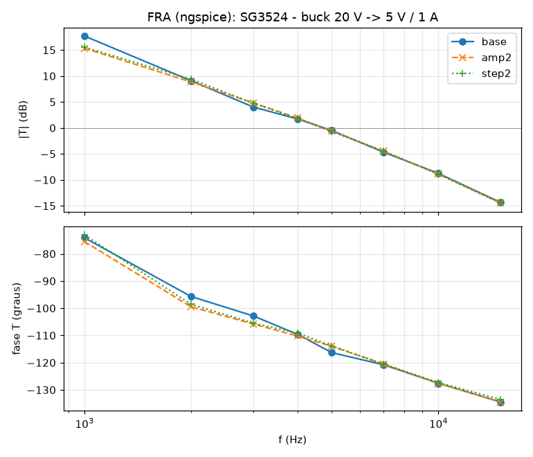

# SG3524 — behavioural SPICE model for LTspice

A functional (`.subckt`) macromodel of the **SG3524 SMPS control circuit**, built
from three datasheets for the same part, cross-checked against each other:
Philips Semiconductors (1994), STMicroelectronics (2000) and Texas
Instruments (SLVS077D, 2003).

It is not a transistor-level model. Every block of the datasheet block diagram
(Figure 2) is reproduced by its **terminal behaviour**, with numbers taken from
the DC Electrical Characteristics table and from the Theory of Operation text.
The point is closed-loop SMPS simulation: it is fast, it converges, and it
reproduces the specs that actually matter when you design a supply around it.

## Files

| File | What it is |
|---|---|
| `SG3524.lib` | the model — a single `.subckt SG3524`, heavily commented |
| `SG3524.asy` | LTspice symbol, 16-pin DIP layout, pin order 1…16 |
| `examples/` | netlists prontos: malha aberta, buck, boost, buck-boost inversor, push-pull |
| `tests/` | datasheet regression tests (see *Verification*) |

## Installing in LTspice

1. Copy `SG3524.lib` and `SG3524.asy` next to your schematic (or into
   `Documents\LTspiceXVII\lib\sub` and `...\lib\sym`).
2. Place the symbol with **F2 → (your directory) → SG3524**.
3. The symbol already carries `SYMATTR ModelFile SG3524.lib`, so LTspice pulls
   the model in by itself. If you prefer, add a directive by hand:

```
.include SG3524.lib
```

In a plain netlist:

```
X1 1 2 3 4 5 6 7 8 9 10 11 12 13 14 15 16 SG3524
```

### What to put on the schematic

One directive, and it is the `.tran` itself:

```
.tran 0 <stop> 0 <maxstep>        e.g.  .tran 0 4m 0 100n
```

Set `maxstep` to **1–2 % of the switching period**. The examples run at
50–100 kHz with 100–200 ns, and their loop gain does not move when the step
is halved (see *LTspice .FRA* below); a coarser step lands the PWM edges on
the solver's step grid and the duty cycle jitters. If the power stage uses
ideal switches (`S` elements), also add `.options method=gear` — the
examples do, for the reason given in the same section.

**With the outputs separate (push-pull), also keep `maxstep` near or below
the dead time** (0.5 µs per 10 nF of C<sub>T</sub>). The blanking pulse *is*
the dead time and the flip-flop's only clock; a step much longer than the
pulse can skip it, and then the same output fires twice in a row — in a
push-pull that walks the transformer towards saturation. With the outputs
paralleled (buck, boost, …) a skipped toggle changes nothing. The discharge
cell was rebuilt so that a long step cannot leave it half-way (see *Notes*),
which made this rare, but not impossible. Measured at R<sub>T</sub> = 10 k
("failed toggle" = the same output firing twice in a row):

| C<sub>T</sub> (dead time) | maxstep | failed toggles, Gear / trapezoidal | period, Gear / trapezoidal (cycle-to-cycle rms) |
|---|---|---|---|
| 10 nF (0.5 µs) | free running | 0 / 1 of 165 | 100.80 µs (0.01 %) / 100.82 µs (0.03 %) |
| | 500 ns | 1 / 0 of 165 | 100.78 µs (0.04 %) / 100.83 µs (0.20 %) |
| | 250 ns | 0 / 0 of 165 | 100.79 µs (0.05 %) / 100.86 µs (0.20 %) |
| | 100 ns | 0 / 0 of 165 | 100.75 µs (0.04 %) / 100.84 µs (0.23 %) |
| | 50 ns | 0 / 0 of 165 | 100.77 µs (0.07 %) / 100.84 µs (0.15 %) |
| 1.25 nF (67 ns), the push-pull example | 500 ns | **21 of 94** (Gear) | 12.72 µs (0.08 %) |
| | 200 ns | 0 / 0 of ~920 | 12.72 µs (0.08 %) / 12.74 µs (0.45 %) |
| | 100 ns | 0 / 0 of ~920 | 12.72 µs (0.09 %) / 12.74 µs (0.41 %) |

At C<sub>T</sub> = 22 nF (Gear) the period is 221.5 µs and the valley
0.593 V at every step from free running down to 20 ns. The period itself no
longer depends on the step; only the toggling does, and only with steps as
long as the dead time or longer (or none at all).

**Do not relax the tolerances.** `reltol`, `abstol`, `vntol` and `trtol` should
stay at their defaults. Relaxing them no longer breaks the model (it did before
the timing hierarchy was fixed), but it buys nothing here and costs accuracy.
Limiting the step is the opposite of relaxing, and it is what this model wants.

If you do hit `Time step too small`, try, in this order: **Control Panel →
SPICE → Solver: `Alternate`**, then `.options cshunt=1e-15`. Neither should be
necessary — if you need one, that is a bug worth reporting.

## Pinout

The port order is the DIP pin order, pin 1 through pin 16:

| # | Name | Function |
|---:|---|---|
| 1 | `INV` | inverting input, error amplifier |
| 2 | `NI` | non-inverting input, error amplifier |
| 3 | `OSC` | oscillator output / blanking pulse / SYNC terminal |
| 4 | `CLP` | (+) current-limit sense |
| 5 | `CLM` | (−) current-limit sense |
| 6 | `RT` | timing resistor — held at 3.6 V, so I<sub>charge</sub> = 3.6 V / R<sub>T</sub> |
| 7 | `CT` | timing capacitor — linear ramp |
| 8 | `COM` | ground (device reference; **does not have to be node 0**) |
| 9 | `COMP` | compensation / error-amplifier output, high impedance |
| 10 | `SD` | shutdown, active high, internal 10 k to ground |
| 11 | `EA` | emitter A |
| 12 | `CA` | collector A |
| 13 | `CB` | collector B |
| 14 | `EB` | emitter B |
| 15 | `VIN` | supply |
| 16 | `VREF` | 5 V reference output; also supplies all internal circuitry |

Everything inside the model is referenced to `COM`, not to node 0, so the part
works with a lifted ground.

## Setting the frequency

The datasheet gives **both** “charging current = 3.6 V / R<sub>T</sub>” **and**
“period t = R<sub>T</sub>·C<sub>T</sub>” (t in µs with R<sub>T</sub> in Ω and
C<sub>T</sub> in µF). Those two statements together fix the ramp swing at
3.6 V, which is what this model uses: CT ramps from **0.6 V to 4.2 V**.

```
f_osc = 1 / (RT * CT)
```

Keep 1.8 k < R<sub>T</sub> < 100 k (charging current 30 µA … 2 mA) and
C<sub>T</sub> between 0.001 and 0.1 µF, as the datasheet asks.

* **Push-pull**: outputs separate. Each output runs at *half* f<sub>osc</sub>,
  0…45 % duty each.
* **Single ended**: tie CA to CB and EA to EB. The output runs at f<sub>osc</sub>,
  0…90 % duty.

### The vendors disagree on frequency — pick yours

All three datasheets agree the charging current is 3.6 V / R<sub>T</sub>. They
do **not** agree on how far the C<sub>T</sub> ramp swings, so the same
R<sub>T</sub> and C<sub>T</sub> give three different frequencies — a 30 %
spread end to end. In the same units (R<sub>T</sub> in kΩ, C<sub>T</sub> in µF,
f in kHz):

| Vendor | Quoted formula | Swing | Override | Model vs formula |
|---|---|---|---|---|
| Philips 1994 | `t = RT·CT` | 3.60 V | *(default)* | −0.8 % |
| ST 2000 | `f = 1.18/(RT·CT)` | 3.05 V | `VCTH=3.65 GDIS=71m` | −0.9 % |
| TI 2003 | `f = 1.30/(RT·CT)` | 2.77 V | `VCTH=3.37 GDIS=69m` | −1.1 % |

```
X1 … SG3524 VCTH=3.37 GDIS=69m      ; TI part
```

`GDIS` rides along with `VCTH` to hold the blanking pulse at the 0.5 µs that
all three specify for C<sub>T</sub> = 0.01 µF; measured 0.501 / 0.501 / 0.501 µs.
Leaving it out costs 5 % on the dead time and nothing else.

**Everything else is identical across the three datasheets** — reference,
error amplifier, comparator thresholds, current limit, output stage, standby
current — so the vendor choice only moves the frequency.

## Everything is a parameter

Any value in the `.param` list at the top of the subcircuit can be overridden
per instance, e.g. for a corner run:

```
X1 … SG3524 VREFNOM=4.6 VOS=10m IBIAS=10u DMAX=1
```

Useful ones: `VREFNOM VDROP IREFSC ICC` (reference/supply), `VRT VCTL VCTH
GDIS VCTMIN` (oscillator: ramp ends, discharge conductance and its floor),
`VCMIN VCMAX DMAX` (comparator), `GMEA IEAMAX VOS IBIAS REAO CEAO` (error
amp), `VCLTH GCLV` (current limit), `VSDTH` (shutdown), `VCESAT RCE RLEAK`
(output transistors). `GLAT TLAT QON` set the discharge cell (see *Notes*);
leave them alone unless you are changing the model.

## Verification

`tests/` holds a datasheet-driven regression suite. It runs under **ngspice**,
which needs the PSpice-style `PARAMS:` keyword on the `.subckt` line — that one
keyword is the only difference from the LTspice file, and `run_tests.sh`
generates the ngspice copy automatically.

```
cd tests && ./run_tests.sh
```

All 30 checks pass. What they pin down:

| Measured | Model | Datasheet |
|---|---|---|
| V<sub>REF</sub>, V<sub>IN</sub> = 8/20/40 V | 5.000 V | 5.0 V, 10 mV line reg |
| V<sub>REF</sub> load regulation at 20 mA | 20 mV | 20 mV typ |
| V<sub>REF</sub> short-circuit current | 105 mA | 100 mA |
| Standby I<sub>IN</sub> at V<sub>IN</sub> = 40 V | 8.0 mA | 8 mA typ, 10 mA max |
| Oscillator period, R<sub>T</sub>=10 k, C<sub>T</sub>=10 nF | 100.8 µs | R<sub>T</sub>·C<sub>T</sub> = 100 µs |
| …at C<sub>T</sub> = 100 nF / 2 nF / 1 nF | 1006 µs / 20.28 µs / 10.20 µs | 1000 / 20 / 10 µs |
| Dead time at C<sub>T</sub> = 0.01 µF | 0.50 µs | 0.5 µs |
| Pin 3 amplitude | 3.49 V | 3.5 V<sub>p</sub> |
| Pin 6 voltage | 3.600 V | 3.6 V |
| Duty at V(COMP) = 1.0 V | 0.0 % | zero duty threshold 1 V |
| Duty at V(COMP) = 3.5 V | 44.6 % / output | max duty threshold 3.5 V, 45 % |
| Duty at V(COMP) = 2.25 V | 21.6 % | linear |
| Outputs paralleled | 89.2 % at f<sub>osc</sub> | 0–90 % single ended |
| Output phasing | 180°, never overlapping | pulse-steering flip-flop + blanking |
| V<sub>CE(sat)</sub> at 50 mA | 1.00 V | 1 V typ, 2 V max |
| Current limit, 200 mV sense | 24.3 % duty | “input voltage required to get 25 % duty” |
| Current limit, 100 / 300 mV | no action / outputs off | 200 mV threshold |
| Shutdown pin 10 = 2 V | pin 9 → 0.22 V, outputs off | active high |
| External sync on pin 3 | locks to 80 µs master | sync via pin 3 |
| V<sub>IN</sub> = V<sub>REF</sub> = 5 V | runs normally | 5 V operation, pins 15+16 tied |

## Topologias

O CI nao sabe qual conversor ele esta acionando — ele so gera PWM. Quem muda e
o estagio de potencia externo. Ainda assim, "deveria funcionar" nao e prova,
entao cada topologia de `examples/` e simulada em malha fechada e verificada
por `examples/run_examples.sh`:

| Exemplo | Topologia | Resultado medido |
|---|---|---|
| `01_malha_aberta.cir` | push-pull sem malha | periodo = R<sub>T</sub>·C<sub>T</sub>, tempo morto 0,5 µs, saidas nunca sobrepostas |
| `06_circuito_teste_datasheet.cir` | **circuito de teste da Figura 4** | 20 kHz, V<sub>REF</sub> 5 V, amp de erro em ganho unitario, V<sub>CE(sat)</sub> < 1,1 V |
| `02_buck.cir` | buck 20 V → 5 V / 1 A | regula 5 V, aguenta degrau de carga 1 A → 2 A; **cruzamento 4,8 kHz, MF 65°** (FRA) |
| `03_boost.cir` | boost 12 V → 24 V / 1 A | regula 24 V; **cruzamento 1,2 kHz, MF 55°** (FRA) |
| `04_buck_boost_inversor.cir` | buck-boost 12 V → −12 V / 1 A | regula −12 V; **cruzamento 1,2 kHz, MF 46°** (FRA) |
| `05_push_pull.cir` | push-pull com transformador 24 V → 5 V / 2 A, chaves externas | regula 5 V, saidas alternadas em 180°; **cruzamento 2,7 kHz, MF 61°** (FRA) |

```
cd examples && ./run_examples.sh
```

Dois detalhes que valem lembrar ao trocar de topologia:

* **Saida negativa** (buck-boost inversor): o somador de realimentacao tem que
  entrar pelo **pino 2 (NI)**, nao pelo pino 1 (INV). Pelo INV a realimentacao
  vira positiva e o conversor dispara.
* **Push-pull** quer as saidas **separadas** (cada uma em metade do primario);
  buck, boost e buck-boost querem as saidas **em paralelo** (CA=CB, EA=EB),
  o que dobra a frequencia efetiva e o duty maximo.

### Compensacao e sua, nao do CI

O SG3524 fornece o **amplificador de erro**; a **rede de compensacao e externa**.
O datasheet e explicito:

> *“the compensation terminal is also the place for AC phase compensation... the
> best stabilizing network is a series RC combination between Pin 9 and ground...
> A good starting point is 50 kΩ plus 0.001 µF.”*

O modelo reproduz o amplificador (g<sub>m</sub> = 2 mA/V, saida de 5 MΩ, polo,
excursao 0,5–3,8 V, ±200 µA). As redes dos exemplos foram **projetadas para
margem de fase ≥ 45° e conferidas com FRA** (ver abaixo), com tres recursos:

* **R<sub>cz</sub> + C<sub>cz</sub> + C<sub>p</sub> no pino 9** (tipo II) — o
  zero de R<sub>cz</sub>·C<sub>cz</sub> fica bem abaixo do cruzamento;
* **C<sub>ff</sub> em paralelo com o resistor de cima do divisor** — um par
  zero/polo que da avanco de fase em volta do cruzamento (ate ~20° com
  divisor 2:1, ~50° com 9,6:1 no boost);
* **C<sub>p</sub> grande o bastante** para o ripple de chaveamento que o
  C<sub>ff</sub> deixa passar nao chegar ao pino 9: no boost, sem isso, o
  pino 9 tinha 0,37 V p-p de ripple (15 % da faixa do PWM) e o modulador saia
  do regime linear.

Limites reais que mordem:

* o pino 9 so fornece **±200 µA**, entao um capacitor grande ali limita o slew
  (1 µF ⇒ 0,2 V/ms: o boost e o inversor levam ~15 ms para partir);
* um filtro LC pouco amortecido chega a −180° antes do cruzamento; buck,
  inversor e push-pull tem uma rede R-C amortecedora em paralelo com a saida
  exatamente por isso;
* **conversor perto da fronteira CCM/DCM** muda de ganho com a amplitude do
  sinal. O boost e o inversor eram de 0,5 A, com o vale da corrente no
  indutor em 0,4 A: 25 mV de injecao no FRA ja levavam o vale a zero e o
  ganho de malha mudava 3 dB com a amplitude. Com 1 A o vale fica em ~1,4 A.

## LTspice .FRA (loop gain)

LTspice's `.fra` measures the loop gain in the time domain, so a model is
"FRA-robust" only if a small injected sine produces a response that is linear
and does not depend on the solver step. `tools/fra/` (see the top-level
README) emulates `.fra` in ngspice and runs every loop three times — nominal,
twice the injection amplitude, half the maximum step. The examples' feedback
paths all go through a `Vinj`-ready divider: in LTspice, put the FRA
component in series between the output and the top of the divider.

| Example | Crossover | Phase margin | Worst deviation (2× amplitude / dt/2) | Verdict |
|---|---|---|---|---|
| buck 20 → 5 V / 1 A | 4.76 kHz | 65° | 0.8 dB / 3° above 2 kHz | pass |
| boost 12 → 24 V / 1 A | 1.16 kHz | 55° | 0.16 dB / 1.2° | pass |
| inverting buck-boost 12 → −12 V / 1 A | 1.18 kHz | 46° | 0.10 dB / 1.4° | pass |
| push-pull 24 → 5 V / 2 A | 2.73 kHz | 61° | 0.43 dB / 2.1° | pass |



What it took — worth knowing for your own FRA runs on SG3524 designs:

* **The oscillator's discharge latch was rebuilt** (see *Notes* below). The old
  regenerative latch could be left at its unstable midpoint by an implicit
  integrator taking long steps, which produced lost or 1.7 µs-short pulses at
  some step sizes and not others. In an FRA that is noise, or a result that
  moves with `maxstep`. The new latch has no unstable equilibrium.
* **Use `.options method=gear` with ideal switches** (`S` elements). With the
  trapezoidal integrator the switch node rings numerically at every turn-off
  and injects spurious current into the inductor. The first FRA of the buck
  example showed output spikes to 8 V that were purely numerical.
* **Keep the PWM edge resolved.** With `maxstep` far above the dead time, the
  PWM edges (the model's comparator and your ideal switch alike) land on the
  solver's step grid. At 500 ns on a 50 kHz boost the on-time wandered ±0.1 µs
  from cycle to cycle. The examples use 100–200 ns.
* **Mind the operating point.** A converter near the CCM/DCM boundary changes
  gain with the injection amplitude, and so does a push-pull whose
  transformer has a small magnetizing inductance. Both were in the old
  examples and are fixed now.

## What is *not* modelled

Read this before trusting a result.

* **No temperature or tolerance modelling.** Everything is the typical value at
  25 °C. Use the parameters above for corner runs.
* **Common-mode limits are not enforced.** The error amplifier’s 1.8–3.4 V input
  range and the current-limit sense ±1 V range are *not* policed — the model
  keeps working outside them, the real part does not.
* **No 300 kHz ceiling.** That is a device limit, not a formula limit; the model
  will happily run past it.
* **The period runs long by 0.6–2 %.** The ramp's valley sits a little below
  0.6 V (the discharge cell's response time allows a small undershoot) and
  fixed internal delays add a roughly constant amount to every cycle: +0.6 %
  at C<sub>T</sub> = 100 nF, +0.8 % at 10 nF, +1.4 % at 2 nF, +2 % at 1 nF.
  That is the same mechanism that stops the real part at 300 kHz; the
  vendors' formulas disagree by 30 % among themselves anyway (see above).
* **Reference line regulation is ideal** above the dropout point.
* **Output edges** are a fixed ~47 ns drive slew; real edges (0.2 µs / 0.1 µs
  with R<sub>C</sub> = 2 k) are mostly set by your external load.
* **There is no `.op` solution while the oscillator runs** — an oscillator has
  no DC operating point, so the simulator will fall back to a transient start.
  That is expected and harmless for `.tran`. If you want a valid `.op` or an
  `.ac` sweep of the error amplifier, stop the oscillator by leaving pin 6 open
  (`RT` removed); the model then has a proper DC solution.

## Notes on a few details

* **Pin 3 capacitance widens the blanking pulse.** Hang ~100 pF off pin 3 and
  the dead time grows, exactly as the datasheet describes for small C<sub>T</sub>.
* **Pin 4 open with pin 5 grounded shuts the outputs off.** Both sense pins sit
  on the same weak 0.5 V bias, so leaving *both* open does nothing, while the
  documented auxiliary-shutdown connection works.
* **Pin 9 can only source ~200 µA.** That is real, and it is why loading pin 9
  with a low-value divider collapses the gain (datasheet Figure 7,
  A<sub>V</sub> = 0.002·R<sub>L</sub>). Remember it when you size a compensation
  network: a big capacitor on pin 9 slew-limits at 200 µA / C.
* **The reference can only source.** Tying pins 15 and 16 to an external 5 V
  rail works, as the datasheet says it should.
* **The C<sub>T</sub> discharge is resistive and its latch is not
  regenerative.** C<sub>T</sub> discharges through a conductance (`GDIS`)
  towards a floor below the reset threshold (`VCTMIN`), so near the reset it
  is slowing down instead of racing through it, and a coarse step lands the
  valley in the same place. The bit that says "discharging" is an
  integrating set/reset cell (`GLAT`, `TLAT`, `QON`) that holds itself set
  through the discharge but has no positive feedback, so it has no unstable
  midpoint. An earlier version used an ordinary regenerative latch; Gear and
  backward Euler, stepping far longer than its regeneration time, can treat
  that midpoint as stable, and at some step sizes (50 and 100 ns, not 200 ns)
  the buck example lost cycles or produced pulses 1.7 µs short. The
  comments in `SG3524.lib` go through it in detail.

## Licence

Public domain / CC0. No warranty — check anything safety-critical against
hardware.
