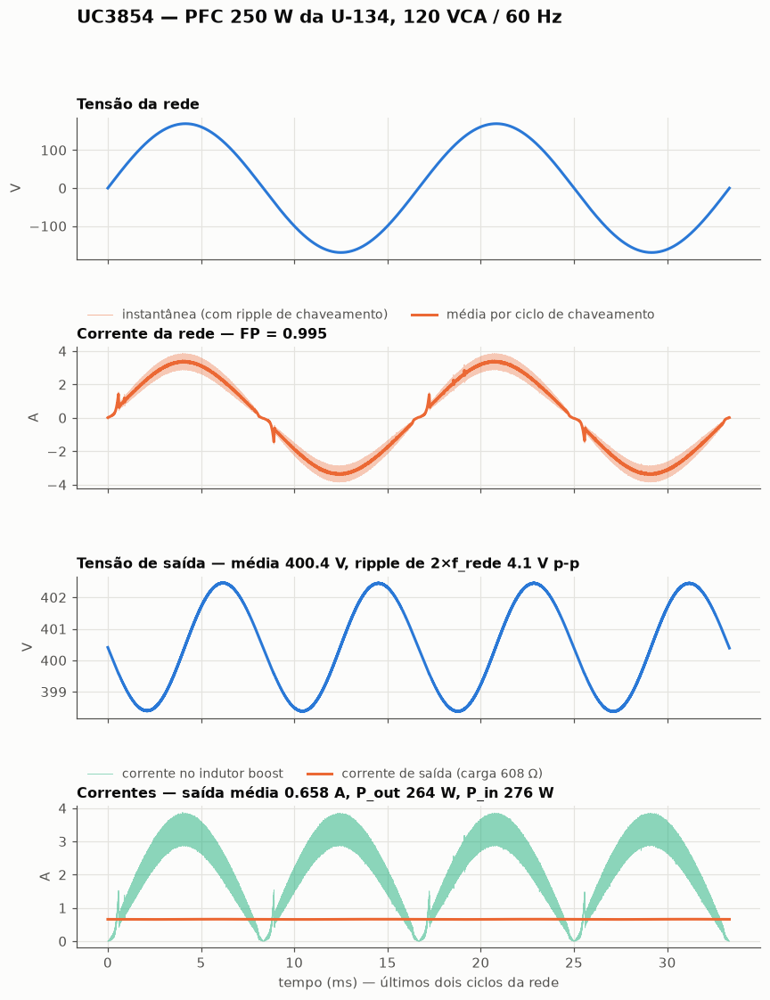
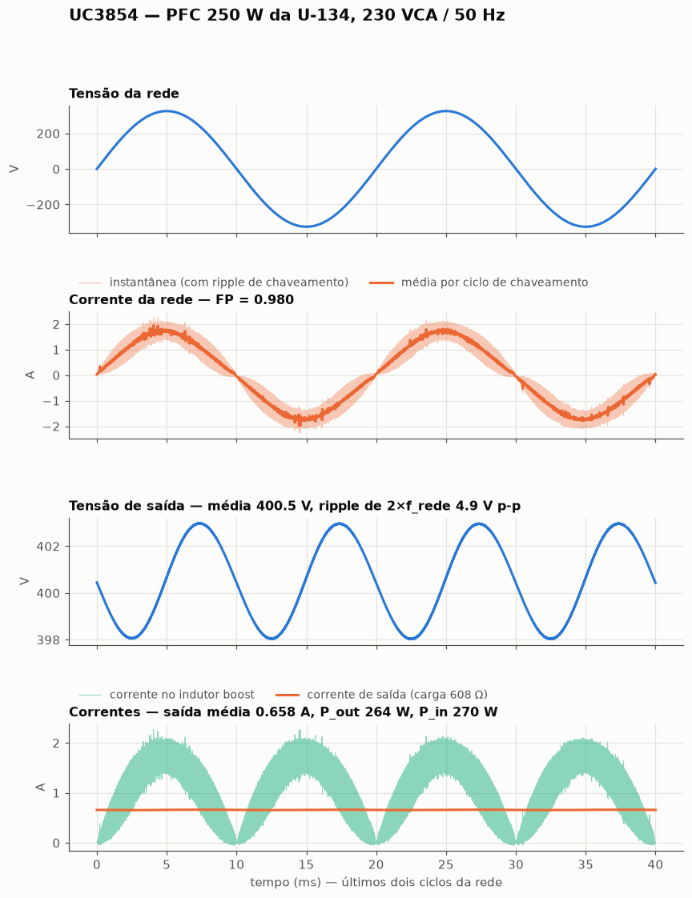
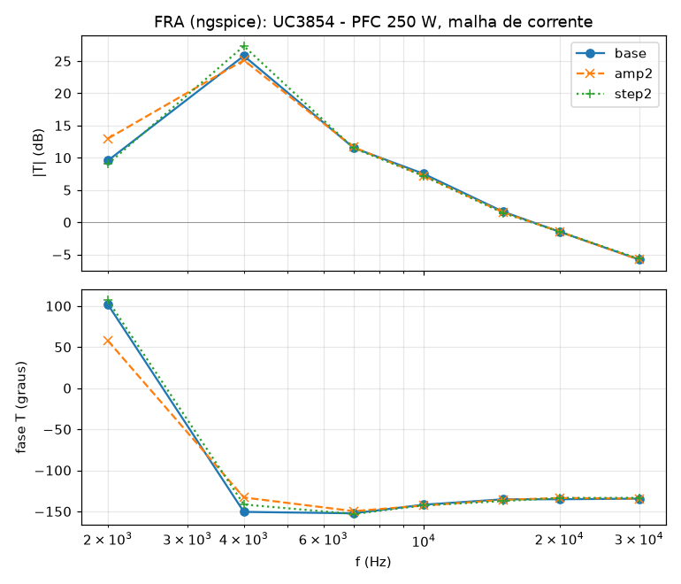

# UC3854 — behavioural SPICE model for LTspice

A functional (`.subckt`) macromodel of the **UC3854 high power factor
preregulator**, the classic average-current-mode PFC controller. It was built
from the Unitrode/TI datasheet (UC1854/UC2854/UC3854, 6/98) and application note
**U‑134 (SLUA144)**, *"UC3854 Controlled Power Factor Correction Circuit
Design"*.

It is not a transistor-level model. Every block of the datasheet block diagram
is reproduced by its **terminal behaviour**, with numbers taken from the
Electrical Characteristics table, the pin descriptions, the typical-characteristic
curves and the U‑134 design text. The goal is closed-loop PFC simulation: it is
fast, it converges, and it reproduces the specs that matter when you design a
preregulator around it.

## Files

| File | What it is |
|---|---|
| `UC3854.lib` | the model: a single `.subckt UC3854`, heavily commented |
| `UC3854.asy` | LTspice symbol, 16-pin DIP layout, pin order 1…16 |
| `examples/` | ready-to-run netlists: open loop, and the U‑134 250 W PFC at 120 V and 230 V |
| `tests/` | datasheet regression tests (see *Verification*) |

## Installing in LTspice

1. Copy `UC3854.lib` and `UC3854.asy` next to your schematic (or into
   `Documents\LTspiceXVII\lib\sub` and `...\lib\sym`).
2. Place the symbol with **F2 → (your directory) → UC3854**.
3. The symbol already carries `SYMATTR ModelFile UC3854.lib`, so LTspice pulls
   the model in by itself. If you prefer, add the directive by hand:

```
.include UC3854.lib
```

In a plain netlist:

```
X1 1 2 3 4 5 6 7 8 9 10 11 12 13 14 15 16 UC3854
```

### What to put on the schematic

```
.tran 0 <stop> 0 <maxstep>        e.g.  .tran 0 100m 0 100n
```

Set `maxstep` to about **1 % of the switching period** (100 ns at 100 kHz).
The model does not *need* it to keep switching. The latches were built so they
hold their state at any step size, and the oscillator never misses a cycle up
to 200 ns steps at 100 kHz. The step size does move the ramp valley and the
period a little, though:

| R<sub>SET</sub>, C<sub>T</sub> | formula | step 20 ns | step 100 ns | step 200 ns |
|---|---|---|---|---|
| 15k, 1.5 nF | 55.6 kHz | 55.7 kHz | 54.7 kHz | 54.6 kHz |
| 10k, 1.2 nF (U‑134) | 104.2 kHz | 101.5 kHz | 100.3 kHz | 98.0 kHz |
| 8.2k, 1.5 nF | 101.6 kHz | 97.8 kHz | 98.3 kHz | 98.4 kHz |
| 10k, 10 nF | 12.5 kHz | 12.3 kHz | 12.4 kHz | 12.6 kHz |
| 47k, 4.7 nF | 5.7 kHz | 5.9 kHz | 5.8 kHz | 6.1 kHz |

The PFC examples run at 100 ns. The power stage wants a small step anyway.

If you do hit `Time step too small`, look at the power stage first. Every one
of those that came up while writing the examples was in the external circuit
(see *Two netlist traps* below). For LTspice, try **Control Panel → SPICE →
Solver: Alternate**, then `.options cshunt=1e-15`.

## Pinout

The port order is the DIP pin order, pin 1 through pin 16:

| # | Name | Function |
|---:|---|---|
| 1 | `GND` | ground (device reference; **does not have to be node 0**) |
| 2 | `PKLMT` | peak current limit. Trips when pulled below **0.0 V** |
| 3 | `CAOUT` | current amplifier output (NPN follower + 8 k to ground) |
| 4 | `ISENSE` | current amplifier inverting input |
| 5 | `MULTOUT` | multiplier output **current** = current amp non-inverting input |
| 6 | `IAC` | multiplier line input: a **current**, pin held at 6.0 V |
| 7 | `VAOUT` | voltage amplifier output (NPN follower + 8 k, clamped 5.8 V) |
| 8 | `VRMS` | feed-forward input, squared and divided into Imo (clamped 4.5 V) |
| 9 | `VREF` | 7.5 V reference (0 V while disabled) |
| 10 | `ENA` | enable, 2.55 V rising / 2.30 V falling |
| 11 | `VSENSE` | voltage amplifier inverting input |
| 12 | `RSET` | held at 3.75 V: sets the oscillator current **and** the Imo limit |
| 13 | `SS` | soft start: 14 µA up, voltage-amp reference while < 7.5 V |
| 14 | `CT` | oscillator timing capacitor |
| 15 | `VCC` | supply, UVLO 16 V on / 10 V off |
| 16 | `GTDRV` | totem-pole gate drive, clamped at 14.5 V |

Everything inside the model is referenced to `GND` (pin 1), not to node 0.

## How each block is modelled

**Multiplier** (Note 5 of the datasheet):

```
Imo = KM · IAC · (VAOUT − 1) / VRMS²          KM = 1 /V
```

limited to **min(2·IAC, 3.75 V/RSET)**, the two limits the datasheet and U‑134
both state. VRMS is clamped at 4.5 V internally, and VA Out below 1 V inhibits
the output. Imo flows *out* of pin 5. Pin 6 is a current input held at 6 V, so
the U‑134 trick of an R<sub>vac</sub>/4 resistor from REF to IAC cancels the
6 V offset exactly as it does on the real part.

**Oscillator.** RSET is held at 3.75 V. CT charges with 1.9·I<sub>SET</sub> and
discharges with a fixed 12 mA between a 1.1 V valley and a 6.5 V peak (5.4 V
peak to valley). Those two numbers were fitted so that the model reproduces
**both** the frequency formula and the maximum-duty curve:

* `F = 1.25 / (RSET · CT)`: 55.4 kHz at 15k/1.5 nF (datasheet 55 typ), 98 kHz
  at 8.2k/1.5 nF (datasheet 102 typ, 86…118).
* "Gate Drive Maximum Duty Cycle vs RSET": 80 % at 3k, 94 % at 10k, 95 % at 15k,
  98 % at 50k. That curve is exactly what a *fixed* discharge current gives,
  because the dead time stays the same while the charging time grows with RSET.

**PWM.** CT is compared directly with CA Out. The RS latch is set by the
oscillator pulse and reset by the comparator or by PKLMT, and the output is
blanked during the discharge. That gives 0 % duty with CA Out below the 1.1 V
valley, a linear rise across the 5.4 V ramp (the `Vs` of the U‑134 current-loop
design), and ~95 % maximum. Once reset, the output stays off until the next
clock, so PKLMT works **cycle by cycle** and ripple on CA Out cannot fire a
second pulse.

**Amplifiers.** Both are op amps (single pole on a high-impedance internal node)
with the datasheet's NPN-follower output stage and **8 k pull-down**:

| | voltage amp | current amp |
|---|---|---|
| DC gain | 100 dB | 110 dB |
| unity gain | 1 MHz (curve) | 800 kHz (typ GBW) |
| output swing | 0.5 … 5.8 V | 0.5 … min(16 V, VCC − 2 V) |
| short-circuit source | 20 mA | 20 mA |
| sink | only the 8 k | only the 8 k |
| input bias | 25 nA out of VSENSE | 120 nA out of ISENSE |

The non-inverting input of the voltage amp is `min(7.5 V, V(SS))`, which is what
the "ideal diodes" of the block diagram mean. Both amplifiers stay active while
the chip is disabled, as the pin descriptions say.

**Enable and supply.** UVLO is 16 V / 10 V and ENA is 2.55 V with 0.25 V of
hysteresis. REF, the oscillator, soft start and the gate drive only run when
both are true. Supply current is 1.5 mA when off and 10 mA when on, plus
everything the chip sources (gate charge, REF load, amplifier outputs, Imo).

**Gate driver.** 14.5 V clamp. 12.8 V at −200 mA with VCC = 15 V, 1.0 V low at
200 mA, and 0.9 V at 50 mA with VCC = 0 (the unpowered pull-down that keeps the
MOSFET off during start-up). ~35 ns edges into 1 nF, 0.8 A peak.

## Everything is a parameter

Any value in the parameter list on the `.subckt` line can be overridden per
instance, e.g. for a corner run:

```
X1 … UC3854 VREFNOM=7.4 VOSVA=8m VOSCA=-4m KM=0.9
```

Useful ones: `VREFNOM IREFSC` (reference), `VCCON VCCOFF VENAH VENAL` (UVLO /
enable), `KOSC IDIS VCTL VCTH VRSET` (oscillator), `KM VAOFS VRMSMX KIAC`
(multiplier), `AVA GBWVA SRVA VOSVA VAH` (voltage amp), `ACA GBWCA SRCA VOSCA
CAH` (current amp), `ISS` (soft start), `VPKTH TPK` (peak limit), `VGCL ROH ROL
IGPK TDRV` (gate driver).

## Verification

`tests/` holds a datasheet-driven regression suite. It runs under **ngspice**,
which needs the PSpice-style `PARAMS:` keyword on the `.subckt` line. That one
keyword is the only difference from the LTspice file, and `run_tests.sh`
generates the ngspice copy automatically.

```
cd tests && ./run_tests.sh
```

All 57 checks pass:

| Measured | Model | Datasheet |
|---|---|---|
| V<sub>REF</sub> at VCC = 18 V / 35 V | 7.500 / 7.500 V | 7.5 V typ, 7.4…7.6; line reg < 10 mV |
| V<sub>REF</sub> load regulation, 10 mA | 5 mV | 5 mV typ, 15 max |
| V<sub>REF</sub> short-circuit current | 28 mA | 28 typ, 12…50 |
| V<sub>REF</sub> while disabled | 0 V | "remains at 0 V" |
| Supply current on / off | 10.0 / 1.5 mA | 10 / 1.5 typ |
| VCC turn-on / turn-off | 16.0 / 10.0 V | 16 / 10 typ |
| ENA threshold / hysteresis | 2.55 / 0.25 V | 2.55 / 0.25 typ |
| Oscillator, 15k / 1.5 nF | 55.4 kHz | 55 typ, 46…62 |
| Oscillator, 8.2k / 1.5 nF | 98 kHz | 102 typ, 86…118 |
| CT valley / peak-to-valley | 1.10 / 5.40 V | 1.1 / 5.4 typ |
| Max duty, CA Out = 7 V (15k) | 95.9 % | 95 % typ |
| Max duty vs RSET, 3k / 50k | 79 % / 98 % | curve: ~75–80 % / ~98 % |
| Duty, CA Out below valley / mid-ramp | 0 % / 47.5 % | zero / linear |
| GT Drv high, VCC = 18 V, no load | 14.5 V | 14.5 typ |
| GT Drv high, −200 mA, VCC = 15 V | 12.8 V | 12.8 typ, 12 min |
| GT Drv low at 200 mA / 10 mA | 1.00 / 0.05 V | 1.0 / 0.1 typ |
| GT Drv low, VCC = 0, 50 mA | 0.90 V | 0.9 typ |
| GT Drv rise / fall, 1 nF | 31 / 24 ns | 35 ns typ |
| Imo, IAC-limited (100 µA, 10k, 1.25 V) | 200 µA | 200 typ |
| Imo, RSET-limited (450 µA, 15k) | 250 µA | 255 typ, 220…280 |
| Imo, IAC = 0 | 0 | ±2 µA |
| Imo, 50 µA / 2 V / 4 V | 37.5 µA | 42 typ, 33…50 |
| Imo, 100 µA / 2 V / 2 V | 25 µA | 27 typ, 12…38 |
| Imo, 200 µA / 2 V / 4 V | 150 µA | 150 typ |
| Imo, 300 µA / 1 V / 2 V | 250 µA | 225 typ, 150…250 |
| VRMS clamp | 4.5 V | 4.5 V (U‑134) |
| Voltage amp gain / unity gain | 100 dB / ~1 MHz | 100 dB typ / curve |
| Voltage amp clamp, short-circuit | 5.8 V, 20 mA | 5.8 V, 20 mA typ |
| Current amp gain / GBW | 110 dB / 800 kHz | 110 dB / 800 kHz typ |
| Current amp swing | 0.5…16 V | 0.5…16 V |
| SS current at 2.5 V | 14 µA | 14 typ, 6…20 |
| PKLMT current at −0.1 V | 100 µA | 100 typ |
| PKLMT → GT Drv delay | 182 ns | 175 ns typ |
| PKLMT action | cycle by cycle | RS latch in the block diagram |

One datasheet point the ideal multiplier does **not** meet: IAC = 100 µA,
VRMS = 1 V, VA = 2 V gives 100 µA, while the datasheet says 80 typ / 95 max. The
real multiplier's table points scatter about ±10 % around Note 5. The model
follows Note 5 exactly and leaves that point out of the suite.

## Exemplos (em malha fechada)

```
cd examples && ./run_examples.sh              # todos (os PFC levam alguns minutos)
cd examples && ./run_examples.sh 01_malha_aberta.cir
```

| Exemplo | O que e | Resultado medido |
|---|---|---|
| `01_malha_aberta.cir` | condicoes de teste do datasheet, CA Out em rampa, IAC em meia senoide | 55,7 kHz; duty 0 % → 95,7 %; Imo grampeado em 3,75 V/R<sub>SET</sub> = 250 µA |
| `02_pfc_250w_u134.cir` | **PFC de 250 W da U‑134, Figura 6**, 120 V<sub>CA</sub> / 60 Hz | 400,4 V, FP 0,995, THD 3,9 %, deslocamento 1,2°, P<sub>in</sub> 276 W |
| `03_pfc_250w_230vac.cir` | o mesmo circuito em 230 V<sub>CA</sub> / 50 Hz | 400,5 V, FP 0,980, THD 4,8 %, deslocamento 2,8°, P<sub>in</sub> 270 W |

THD = harmonicos 2 a 40 da corrente de linha (a distorcao de que falam o
datasheet e a IEC 555). O FP e o total, com o ripple de 100 kHz incluido. Com
so os 0,47 µF de filtro da Figura 6, esse ripple e o que puxa o FP para 0,98 em
230 V.





Nos graficos: a corrente de linha acompanha a tensao; a saida fica em 400 V com
o ripple de 2×f<sub>rede</sub> que os 450 µF permitem (4,1 V p-p em 120 V, a
U-134 estima 3,7 V p-p); a corrente de saida e constante (0,658 A); e o
rendimento do estagio e ~96 %. Logo depois de cada cruzamento por zero da rede
aparece o **"cusp"** que a U-134 descreve: com a tensao de entrada quase nula o
indutor nao consegue fazer a corrente subir na velocidade pedida, o amplificador
de corrente satura, e quando a tensao volta a corrente passa um pouco do
programado. Os graficos saem de `examples/plot_pfc.py`.

Os exemplos 02 e 03 usam **os componentes da Figura 6 da U‑134 sem mudar
nenhum**: L = 1 mH, C<sub>o</sub> = 450 µF, R<sub>s</sub> = 0,25 Ω,
R<sub>mo</sub> = R<sub>ci</sub> = 3,9k, R<sub>cz</sub> = 20k, C<sub>cz</sub> =
620 pF, C<sub>cp</sub> = 62 pF, R<sub>vi</sub> = 511k, R<sub>vd</sub> = 10k,
R<sub>vf</sub> = 174k, C<sub>vf</sub> = 47 nF, R<sub>vac</sub> = 620k,
R<sub>b1</sub> = 150k, divisor de feed-forward 910k/91k/20k com 0,1 µF e
0,47 µF, R<sub>SET</sub> = 10k, C<sub>T</sub> = 1,2 nF. O ponto e verificar o
modelo contra o projeto publicado, nao ajustar o projeto ao modelo.

### Por que 400 V e nao 390 V

O divisor R<sub>vi</sub>/R<sub>vd</sub> sozinho daria 7,5 V · 52,1 = 390 V, e
a U‑134 diz "390 V e aceitavel". Mas a compensacao da U‑134 (R<sub>vf</sub> em
paralelo com C<sub>vf</sub>) **nao e integradora**: o amplificador de tensao
tem ganho CC R<sub>vf</sub>/R<sub>vi</sub> = 0,34. Entao

```
VA Out = 7,5 + 174k · (7,5/10k − (Vout − 7,5)/511k)
```

e com VA Out ≈ 4,1 V a 250 W a saida assenta em ~400 V. E o erro de regime do
controle proporcional, e o modelo o reproduz porque modela o amplificador como
ele e.

### Dois cuidados de netlist que custaram tempo

* **A rede CA tem que flutuar.** Se o retorno da fonte senoidal for o no 0 (o
  terra do CI), metade da ponte e o resistor shunt ficam em curto e aparecem
  centenas de amperes. Use a fonte entre dois nos e prenda um deles ao terra
  por 10 MΩ.
* **Nao ponha capacitor entre os dois lados do shunt.** Um capacitor de 1 µF
  do retificador (+) ao lado *negativo* do shunt fecha uma malha rigida com a
  ponte e o R<sub>s</sub> de 0,25 Ω, e a simulacao para com "timestep too
  small" no no do shunt. A Figura 6 poe o C1 de 0,47 µF **antes** da ponte,
  no lado CA, que e onde ele esta nos exemplos.

### Compensacao e sua, nao do CI

O UC3854 fornece os dois amplificadores; as redes de compensacao sao externas.
A U‑134 da o procedimento: ganho do amplificador de corrente na frequencia de
chaveamento igual a inclinacao da rampa (V<sub>s</sub> = 5,4 V pico a vale no
modelo) sobre a inclinacao da corrente no indutor, e o polo do amplificador de
tensao tal que o ripple de 120 Hz em VA Out fique em ~1,5 %. O modelo tem a
rampa, o ganho, o GBW e a saida so-fonte com 8 k dos amplificadores, entao os
mesmos calculos valem nele.

## LTspice .FRA (loop gain)

The current loop of the U-134 250 W PFC (`02_pfc_250w_u134.cir`) was measured
with `tools/fra/` (an ngspice emulation of LTspice's `.fra`, see the
top-level README): Middlebrook injection in series between the shunt (low
impedance) and R<sub>mo</sub> (3.9 k), the path by which the current signal
reaches the current amplifier. Each tone is run three times — nominal, twice
the injection amplitude, half the maximum step:

| f (Hz) | \|T\| (dB) | phase | SNR (dB) | Δ 2× amplitude | Δ dt/2 |
|---:|---:|---:|---:|---:|---:|
| 7 k | 11.5 | −152° | 19 | 0.10 dB / 2.6° | 0.05 dB / 0.8° |
| 10 k | 7.5 | −142° | 26 | 0.32 dB / 1.1° | 0.34 dB / 0.8° |
| 15 k | 1.6 | −135° | 26 | 0.11 dB / 0.7° | 0.19 dB / 2.2° |
| 20 k | −1.5 | −135° | 30 | 0.01 dB / 1.5° | 0.00 dB / 1.5° |
| 30 k | −5.8 | −135° | 35 | 0.02 dB / 0.0° | 0.11 dB / 1.0° |

**Crossover 17.5 kHz, phase margin 45°**, linear and step-independent within
0.34 dB / 2.2°. Below ~5 kHz the loop gain is so high that the signal left at
the injection point drowns in the switching ripple (SNR < 20 dB), as it would
in any FRA. A PFC's current-loop gain also changes along the line cycle; the
FRA reports the average over the measurement window, exactly as LTspice's
would.



The examples now use `.options method=gear`. With the trapezoidal integrator
the ideal switch's turn-off made the switch node ring numerically and inject
spurious inductor current (seen on the SG3524 buck: output spikes to 8 V that
were purely numerical). The PFC results are unchanged by it: PF 0.995 / 0.980,
THD 3.9 % / 4.8 %.

## What is *not* modelled

Read this before trusting a result.

* **No temperature or tolerance modelling.** Everything is the typical value at
  25 °C. Use the parameters above for corner runs.
* **The multiplier is ideal inside its limits.** The real one compresses at high
  IAC (about −10 % at 400 µA in *Multiplier Output vs Voltage on Mult*) and
  depends slightly on the Mult Out voltage. Its bandwidth is infinite.
* **Amplifier slew rates are not in the datasheet.** The model uses 5 V/µs for
  both amplifiers. Offsets default to 0 (±8 mV / ±4 mV max): set `VOSVA` and
  `VOSCA` for worst case.
* **Common-mode limits** (−0.3…2.5 V on pins 4 and 5) are not enforced beyond
  the protection diodes, which conduct below about −0.5 V.
* **Oscillator accuracy.** The fit trades a few % of frequency for the right
  maximum-duty curve: −3 % at 8.2k, +4 % at 47k, and lower still at the top of
  the range (−10 % at 1 MHz, −17 % at R<sub>SET</sub> = 3k). Keep R<sub>SET</sub>
  above ~1.5 k: below that the charging current approaches the 12 mA discharge
  and the oscillator stalls.
* **Reference line regulation is ideal** above the 1.5 V dropout.
* **There is no `.op` while the oscillator runs.** An oscillator has no DC
  operating point, so the simulator falls back to a transient start, which is
  harmless for `.tran`. For `.op` or an `.ac` sweep of the amplifiers, hold
  CT with a voltage source (the tests do exactly that).
* **Start-up is not in the examples.** Charging 450 µF to 400 V through a
  1 µF soft-start capacitor takes over half a second. The examples start
  near steady state (`IC=` + `uic`) instead. The model itself handles start-up:
  UVLO, ENA, soft start and REF all come up from zero.

## Licence

Public domain / CC0. No warranty. Check anything safety-critical against
hardware.
